# DATABASE

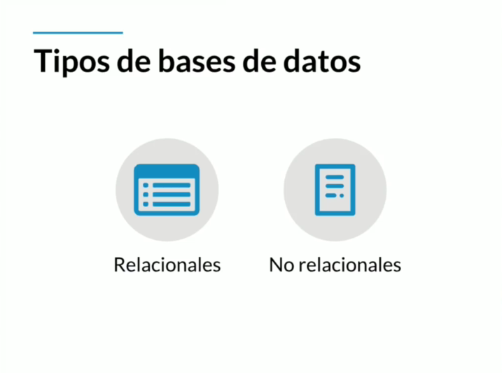

# Base de datos relacional

Una base de datos relacional se basa en la organización de la información en pequeñas unidades relacionadas entre sí mediante identificadores. Utiliza el lenguaje SQL y permite establecer relaciones entre tablas a través de claves primarias y externas. Esto facilita la combinación de información de diferentes tablas mediante operaciones de unión.

Las bases de datos relacionales cumplen con el principio ACID (atomicidad, consistencia, aislamiento y durabilidad), lo que las hace robustas y menos vulnerables a fallos. Estas propiedades garantizan que las transacciones se realicen de forma completa, manteniendo la integridad de los datos y asegurando que los cambios sean duraderos.

Entre las bases de datos relacionales más populares se encuentran MySQL, Oracle, SQL Server y PostgreSQL, que son ampliamente utilizadas en el ámbito informático. Estas bases de datos ofrecen una amplia gama de características y funcionalidades para gestionar grandes volúmenes de datos de manera eficiente y segura.

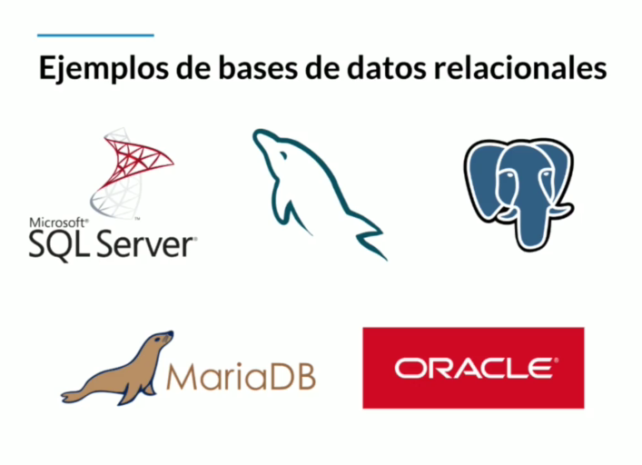

# Base de datos no relacional

Una base de datos no relacional, también conocida como base de datos NoSQL (Not Only SQL), es un tipo de sistema de gestión de bases de datos que difiere del modelo relacional, ya que no utilizan identificadores para relacionar conjuntos de datos. En su lugar, los datos se organizan generalmente en documentos, lo que permite una mayor flexibilidad cuando no se tiene un esquema predefinido.

Las bases de datos no relacionales han ganado popularidad recientemente, y MongoDB lidera este éxito, seguida de cerca por Redis, Elasticsearch y Cassandra. Estas bases de datos ofrecen soluciones eficientes y escalables para el almacenamiento y procesamiento de datos en entornos con volúmenes masivos y cuando se requiere flexibilidad en la estructura de datos.

# Entidades y Atributos

* Entidad: es un objeto que existe y es distinguible de otros objetos (se encierra en un recuadro)
* Atributos: Características o propiedades que describen a la entidad (se encierra en un ovalo)
* Atributo multivaluado: Tiene un conjunto de valores para una entidad (Se encierra en un doble ovalo)
* Atributo compuesto: Se puede dividir en subpartes (es decir, en otros atributos) (de él salen otros atributos)
* Atributo especial o derivados: Su valor se puede obtener a partir de valores de otros atributos (se encierra en un ovalo punteado)
* Atributos llave: Característica o propiedad única de la entidad, lo que lo diferencia de los demás
    * Atributos llave naturales: Son parte de la entidad y no se pueden separar.
    * Atributo llave artificial: No son partes de la entidad y se les asignan de manera arbitraria para facilitar el manejo de la información.

* Entidades fuertes- son entidades que pueden sobrevivir por si solo, tip: al leer la tabla sabes que son las entidades (se encierra en un recuadro)
* Entidades débiles – no puede existir sin una entidad fuerte, tip: al leer la tabla no puedes saber que son las entidades (se encierra en un recuadro doble)
    * Entidades débiles por identidad: es cuando solo se diferencian entre si por la clave de su entidad fuerte
    * Entidades débiles por existencia: se le da su propio ID para diferenciarse de la entidad fuerte

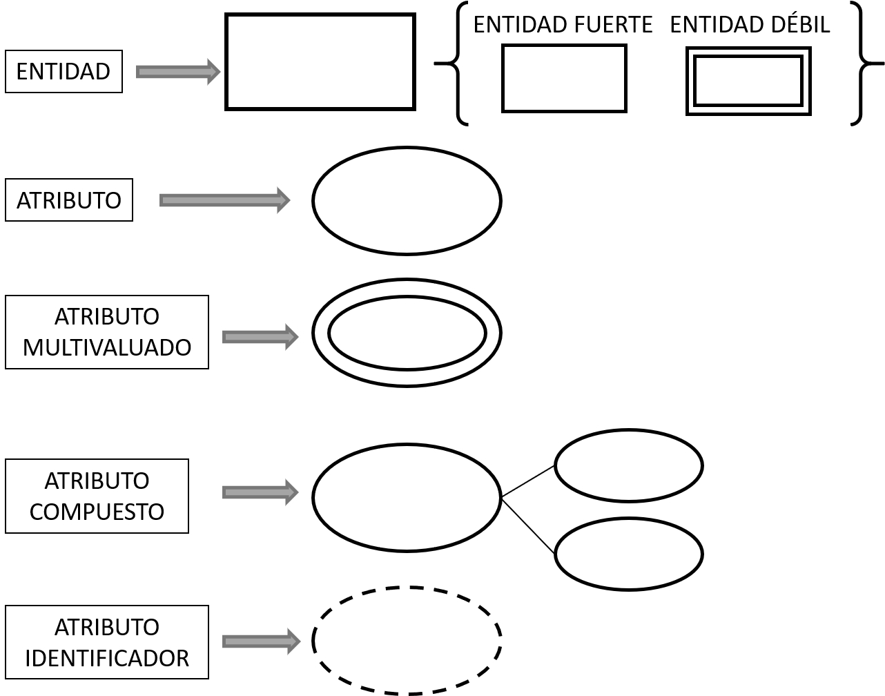

Ejemplo:


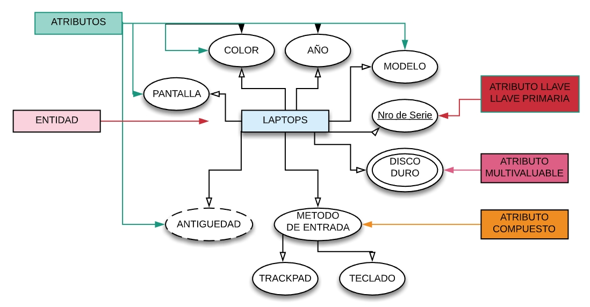

# Datos

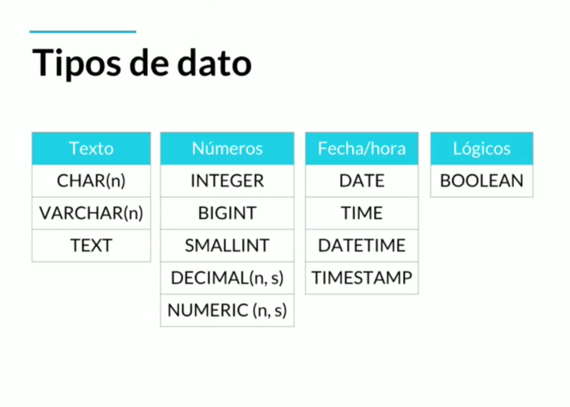

* **CHAR(n)** es un tipo de dato que se utiliza para almacenar cadenas de caracteres de longitud fija. El número "n" especifica la cantidad máxima de caracteres que puede contener la columna CHAR.

* **VARCHAR(n)** es un tipo de dato utilizado para almacenar cadenas de caracteres de longitud variable. A diferencia de CHAR, que asigna un espacio fijo para cada valor, VARCHAR utiliza solo el espacio necesario para almacenar la cadena real. Si la cadena es más corta que la longitud máxima, no se desperdicia espacio con espacios en blanco adicionales. Esto permite un uso eficiente del almacenamiento.

* **TEXT** se utiliza para almacenar cadenas de texto de longitud variable sin una limitación específica en la longitud. Es ideal para almacenar contenido extenso, como párrafos largos o documentos extensos.

* **INTEGER** se utiliza para almacenar valores numéricos enteros. Representa números enteros positivos y negativos sin parte decimal.

    El tipo de dato INTEGER es comúnmente utilizado para almacenar valores como identificadores, contadores, y cualquier otra información que requiera representar cantidades enteras.

* Algunas variantes del tipo INTEGER incluyen **SMALLINT**, que representa enteros más pequeños, y **BIGINT**, que permite almacenar enteros más grandes.

* **DECIMAL(n, s)** se utiliza para almacenar valores numéricos decimales con una precisión fija. Los parámetros "n" y "s" especifican la longitud total y la cantidad de dígitos decimales permitidos, respectivamente.

    El parámetro "n" define la longitud total del número, incluyendo los dígitos decimales y enteros.

    El parámetro "s" indica el número máximo de dígitos decimales permitidos. Por ejemplo, en DECIMAL(8, 2), significa que se reservarán 8 dígitos en total para el número, se permiten hasta 2 dígitos decimales.

* **NUMERIC(n, s)** se utiliza para almacenar valores numéricos con una precisión fija. Los parámetros "n" y "s" especifican la longitud total y la cantidad de dígitos decimales permitidos, respectivamente.

    Este tipo de dato es ideal cuando se requiere una precisión exacta y no se toleran errores de redondeo. Se utiliza comúnmente para almacenar valores monetarios, tasas de interés y otros datos que requieren una precisión decimal 
    
* **DATE** se utiliza para almacenar fechas sin incluir información sobre la hora. Representa una fecha en formato 'YYYY-MM-DD', donde YYYY es el año, MM es el mes y DD es el día.

* **TIME** se utiliza para almacenar información de horas sin incluir la fecha. Representa una hora en formato 'HH:MI:SS', donde HH es la hora, MI son los minutos y SS son los segundos.

* **DATETIME o TIMESTAMP** se utilizan para almacenar información combinada de fecha y hora. Representan una combinación de fecha y hora en formato 'YYYY-MM-DD HH:MI:SS'.

    **DATETIME** generalmente tiene un rango de valores más amplio y puede almacenar fechas y horas desde el año 1000 hasta el año 9999. Por otro lado, el tipo de dato **TIMESTAMP** suele tener un rango de valores más limitado y está sujeto a la precisión del reloj del sistema o a las restricciones establecidas por el sistema de gestión de bases de datos.

* **BOOLEAN** se utiliza para almacenar valores lógicos de verdadero o falso. Es ideal para expresar condiciones binarias y representar información de activado/desactivado, sí/no, verdadero/falso, entre otros.


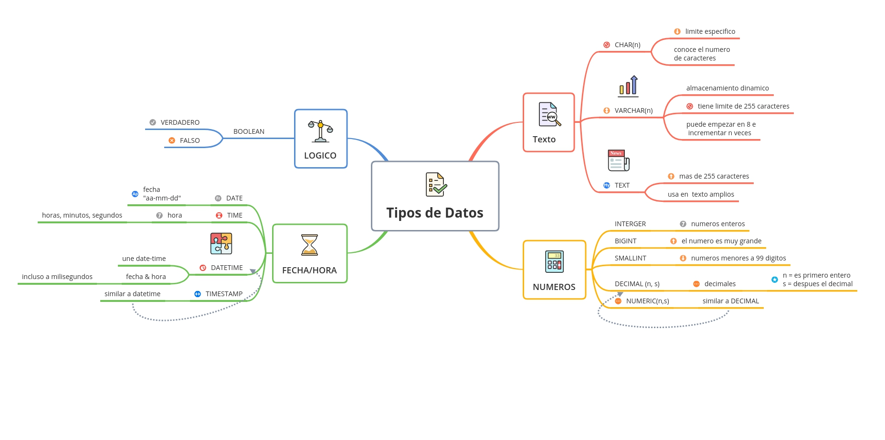


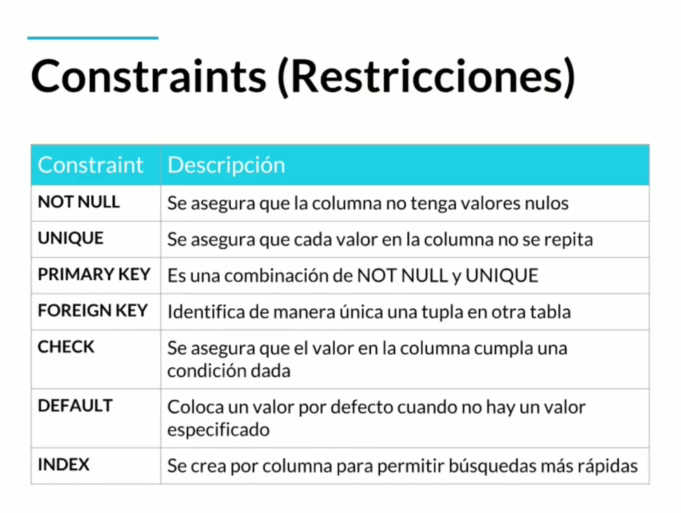

# Relaciones

Las relaciones, representadas por un rombo, sirven para crear relaciones entre entidades. Por convención las relaciones son verbos que conectan entidades. Existen entidades multivaluadas o compuestas que tienen vida propia y se relacionan con otras entidades, por lo que se pueden normalizar (concepto que se explicará luego)

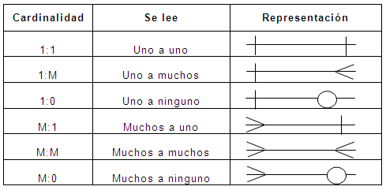

# Cardinalidad

Es una propiedad de las relaciones que indica la cantidad y correspondencia con la que puede estar relacionada una entidad y puede ser uno a uno, uno a varios, varios a uno y varios a varios.


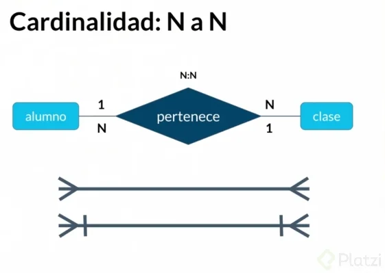


# Comandos SQL

Iniciar SQL como administrador

```sql
mysql -u root -p
```


Para crear un usuario

```sql
 CREATE USER 'nombre_usuario'@'localhost' IDENTIFIED BY 'password';
```

Para eliminar un usuario
```sql
 DROP USER 'nombre_usuario'@'localhost';
 ```

 GRANT

 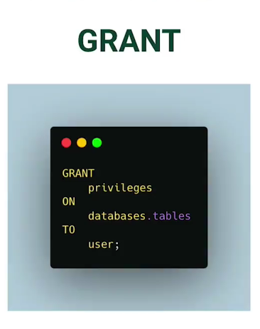

 
 se utiliza para otorgar permisos o privilegios a los usuarios en una base de datos. Permite a los administradores o propietarios de una base de datos asignar diferentes niveles de acceso y control sobre los objetos y operaciones dentro del sistema de gestión de bases de datos.

 ```sql
 GRANT permisos ON objeto TO usuario;
```

FLUSH PRIVILEGES

vuelve a cargar los archivos de permisos y actualiza la memoria caché de privilegios del servidor. Esto asegura que los cambios realizados en los privilegios se reflejen de inmediato y los usuarios puedan ejercer sus nuevos privilegios sin necesidad de reiniciar el servidor.

```sql
GRANT
            privileges
        ON
            databases.tables
        TO
            user;
    FLUSH PRIVIILEGES;
```

###  [DOCUMENTACION GRANT](https://mariadb.com/kb/en/grant/#grant-option)

CREAR BASE DE DATOS

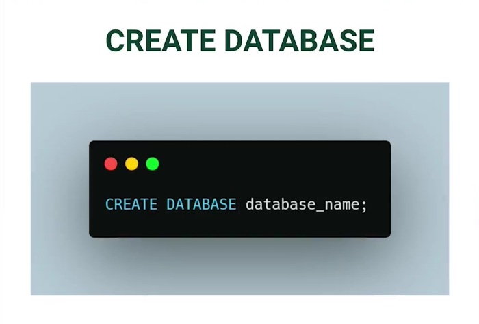

## [AQUI EL ARCHIVO CREATE DATABASE](../SQL/1-create-database.sql)

CREAR TABLAS

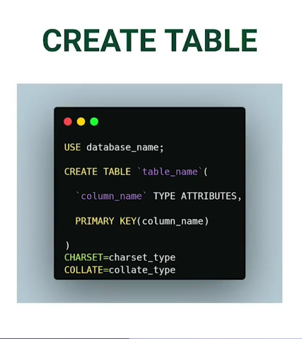

CREATE TABLE se utiliza en SQL para crear una nueva tabla en una base de datos. Esta instrucción permite definir la estructura de la tabla, especificando los nombres de las columnas, los tipos de datos, las restricciones y otros atributos.

 ```sql
 CREATE TABLE nombre_tabla (
    columna1 tipo_dato1,
    columna2 tipo_dato2,
    columna3 tipo_dato3,
    ...
);
```
Por ejemplo, para crear una tabla llamada "Usuarios" con tres columnas, incluyendo "ID" de tipo entero, "Nombre" de tipo cadena de texto y "Edad" de tipo entero, se puede utilizar la siguiente instrucción:

```sql
CREATE TABLE Usuarios (
    ID INT,
    Nombre VARCHAR(50),
    Edad INT
);
```
## [AQUI EL ARCHIVO CREATE TABLE](../SQL/2-create-tables.sql)

ALTER TABLE

se utiliza para realizar modificaciones en la estructura de una tabla existente. Permite agregar, modificar o eliminar columnas, así como agregar o eliminar restricciones, índices y claves.

```SQL
ALTER TABLE nombre_tabla
accion_modificacion;
```

* ADD COLUMN: Se utiliza para agregar una nueva columna a la tabla. Se especifica el nombre de la columna, el tipo de dato y otras propiedades necesarias.

* MODIFY COLUMN: Se utiliza para modificar las propiedades de una columna existente, como el tipo de dato, la restricción NOT NULL, entre otros.

* DROP COLUMN: Se utiliza para eliminar una columna de la tabla.

* ADD CONSTRAINT: Se utiliza para agregar una restricción a la tabla, como una clave primaria, una clave foránea o una restricción de unicidad.

* DROP CONSTRAINT: Se utiliza para eliminar una restricción de la tabla.

Otros tipos de modificaciones: La instrucción ALTER TABLE también permite realizar otras modificaciones, como cambiar el nombre de la tabla, agregar o eliminar índices, entre otros.

## [AQUI EL ARCHIVO ALTER](../SQL/3-alter-table.sql)

 INSERT INTO

 se utiliza para insertar una o varias filas de datos en una tabla específica. 

 ```SQL
 INSERT INTO nombre_tabla (columna1, columna2, columna3, ...)
VALUES (valor1, valor2, valor3, ...);
```

* "nombre_tabla" es el nombre de la tabla en la que deseas insertar los datos.
* Dentro de los paréntesis, se especifican las columnas en las que se insertarán los valores.
* Después de la cláusula VALUES, se especifican los valores correspondientes a cada columna en el mismo orden en el que se mencionaron.

## [AQUI EL ARCHIVO INSERT](../SQL/4-insert-lines.sql)

UPDATE

se utiliza para modificar los datos existentes en una tabla.

* SET: La cláusula SET especifica las columnas que se van a actualizar y los nuevos valores que se les asignarán. 

```SQL
UPDATE nombre_tabla
SET columna1 = valor1, columna2 = valor2, ...
```

* WHERE: La cláusula WHERE se utiliza para especificar una condición que debe cumplir una fila para que se realice la actualización. Solo las filas que cumplan con la condición se verán afectadas por la modificación.

## [AQUI EL ARCHIVO UPDATE](../SQL/7-updating-info.sql)

DELETE FROM

se utiliza para eliminar filas de una tabla en una base de datos.

WHERE

se utiliza para especificar una condición que debe cumplirse para que se eliminen las filas. Solo las filas que cumplan con la condición se eliminarán.

```SQL
DELETE FROM nombre_tabla
WHERE condicion
```
## [AQUI EL ARCHIVO DELETE](../SQL/8-delete-record.sql)

TRUNCATE TABLE

se utiliza para eliminar todas las filas de una tabla en una base de datos. A diferencia de la instrucción DELETE FROM, que elimina las filas una por una, TRUNCATE TABLE elimina todas las filas de una sola vez y reinicia los identificadores de autoincremento, si los hay.

***Es importante tener en cuenta que la instrucción TRUNCATE TABLE no se puede deshacer. Una vez que se ejecuta, no hay forma de recuperar los datos eliminados. Por lo tanto, se recomienda tener precaución al utilizar esta instrucción y asegurarse de tener copias de seguridad adecuadas de los datos antes de ejecutarla.***

```SQL
TRUNCATE TABLE nombre_tabla;
```
## [AQUI EL ARCHIVO TRUNCATE](../SQL/11-truncate.sql)

DROP TABLE

se utiliza para eliminar una tabla completa de una base de datos, incluyendo todas sus filas, columnas, índices y restricciones. Esta acción es permanente y no se puede deshacer.

```SQL
DROP TABLE nombre_tabla;
```
***Al ejecutar esta instrucción, se eliminará por completo la tabla especificada, junto con todos sus datos y elementos asociados. Es importante tener en cuenta que no se podrá acceder ni recuperar ninguna información de la tabla después de eliminarla.***

SELECT

se utiliza en SQL para recuperar datos de una base de datos. Es una de las instrucciones más importantes y frecuentemente utilizadas en SQL.

```SQL
SELECT columnas
FROM tabla
WHERE condicion
```
La instrucción SELECT también se puede combinar con otras cláusulas, como GROUP BY, ORDER BY, JOIN, entre otras, para realizar consultas más complejas y obtener resultados específicos de la base de datos.

## [AQUI EL ARCHIVO SELECT](../SQL/13-select.sql)

# CONEXION SQL CON PHP

Ahora que ya conocemos los conceptos básicos podemos empezar a relacionar los dos lenguajes a través de consultas.

```php
<?php
// Datos de conexión a la base de datos
$host = "localhost"; // Dirección del servidor de la base de datos
$usuario = "usuario_db"; // Nombre de usuario de la base de datos
$password = "contraseña_db"; // Contraseña de la base de datos
$nombre_db = "nombre_db"; // Nombre de la base de datos

// Conexión a la base de datos
$conexion = new mysqli($host, $usuario, $password, $nombre_db);

// Verificar si la conexión tuvo éxito
if ($conexion->connect_errno) {
    die("Error en la conexión a la base de datos: " . $conexion->connect_error);
}

// Consulta SQL
$sql = "SELECT * FROM tabla";

// Ejecutar la consulta
$resultado = $conexion->query($sql);

// Verificar si la consulta tuvo éxito
if (!$resultado) {
    die("Error en la consulta: " . $conexion->error);
}

// Obtener los datos de la consulta
while ($fila = $resultado->fetch_assoc()) {
    // Acceder a los valores de las columnas
    $valor1 = $fila['columna1'];
    $valor2 = $fila['columna2'];
    
    // Hacer algo con los valores obtenidos
    echo "Valor 1: " . $valor1 . "<br>";
    echo "Valor 2: " . $valor2 . "<br>";
}

// Cerrar la conexión a la base de datos
$conexion->close();
?>
```

En este ejemplo, se establece una conexión con la base de datos utilizando la clase `mysqli` de PHP. Luego se ejecuta una consulta SQL para seleccionar todos los registros de una tabla específica. Los datos obtenidos se recorren utilizando un bucle while y se accede a los valores de cada columna. Finalmente, se cierra la conexión a la base de datos.

**`mysqli`** proporciona una interfaz para conectarse a bases de datos MySQL y realizar operaciones como consultas, inserciones, actualizaciones y eliminaciones.

Luego, se ejecuta una consulta SQL utilizando el método `query()` y se recorren los resultados utilizando un bucle `while`. Para acceder a los valores de las columnas de cada fila, se utiliza el método `fetch_assoc()`. Finalmente, se cierra la conexión a la base de datos utilizando el método `close()`.

`fetch_assoc()` se utiliza en PHP con la extensión mysqli para obtener una fila de resultados de una consulta como un array asociativo. Cada elemento del array representa una columna de la fila, donde la clave del array es el nombre de la columna y el valor del array es el valor de esa columna en esa fila.

EJEMPLO:

Para este ejemplo es necesario crear primero las bases de datos necesarias.

```SQL
CREATE TABLE `base1` (

    `id` BIGINT(20) UNSIGNED NOT NULL AUTO_INCREMENT,
    `name` VARCHAR(50) NOT NULL,
    `mail` VARCHAR(70) NOT NULL,
    `codigocurso` INT(10) not null,
    `created_at` TIMESTAMP NOT NULL DEFAULT CURRENT_TIMESTAMP,
    `updated_at` TIMESTAMP NOT NULL DEFAULT CURRENT_TIMESTAMP,

    PRIMARY KEY (id)
    )
    DEFAULT CHARSET=utf8mb4
    COLLATE=utf8mb4_unicode_ci;
```

## [AQUI UN EJEMPLO USANDO UN FORMULARIO](../Samples/SQL/Formulario_Sample.php)

## [AQUI LA PAGINA 2 QUE ES LA QUE NOS MUESTRA LA CONSULTA](../Samples/SQL/pagina2.php)

APLICANDO SELECT PARA REALIZAR CONSULTAS

Veremos entonces como recuperar los datos almacenados en la tabla alumnos de la base de datos "base1".

EJEMPLO:

Supongamos que tienes una tabla llamada "usuarios" con las siguientes columnas: id, nombre, email y edad.

```PHP
<?php
$host = "localhost";
$usuario = "usuario_db";
$password = "contraseña_db";
$nombre_db = "nombre_db";

$conexion = new mysqli($host, $usuario, $password, $nombre_db);

// Verificar si la conexión tuvo éxito
if ($conexion->connect_errno) {
    die("Error en la conexión a la base de datos: " . $conexion->connect_error);
}

$sql = "SELECT id, nombre, email, edad FROM usuarios";
$resultado = $conexion->query($sql);

if (!$resultado) {
    die("Error en la consulta: " . $conexion->error);
}

// Verificar si hay filas de resultados
if ($resultado->num_rows > 0) {
    // Recorrer los resultados y mostrar los datos
    while ($fila = $resultado->fetch_assoc()) {
        echo "ID: " . $fila["id"] . "<br>";
        echo "Nombre: " . $fila["nombre"] . "<br>";
        echo "Email: " . $fila["email"] . "<br>";
        echo "Edad: " . $fila["edad"] . "<br>";
        echo "<br>";
    }
} else {
    echo "No se encontraron resultados.";
}

// Cerrar la conexión a la base de datos
$conexion->close();
?>
```

En este ejemplo, se realiza una consulta SELECT para obtener todos los registros de la tabla "usuarios". Luego, se recorren los resultados utilizando un bucle while y se muestra la información de cada usuario en el formato deseado.

Es importante tener en cuenta que se realiza una verificación adicional con `$resultado->num_rows` para asegurarse de que haya filas de resultados antes de intentar recorrerlos. Si no hay filas, se muestra un mensaje indicando que no se encontraron resultados.

## [AQUI EL ARCHIVO SELECT](../Samples/SQL/Select_DB.php)
