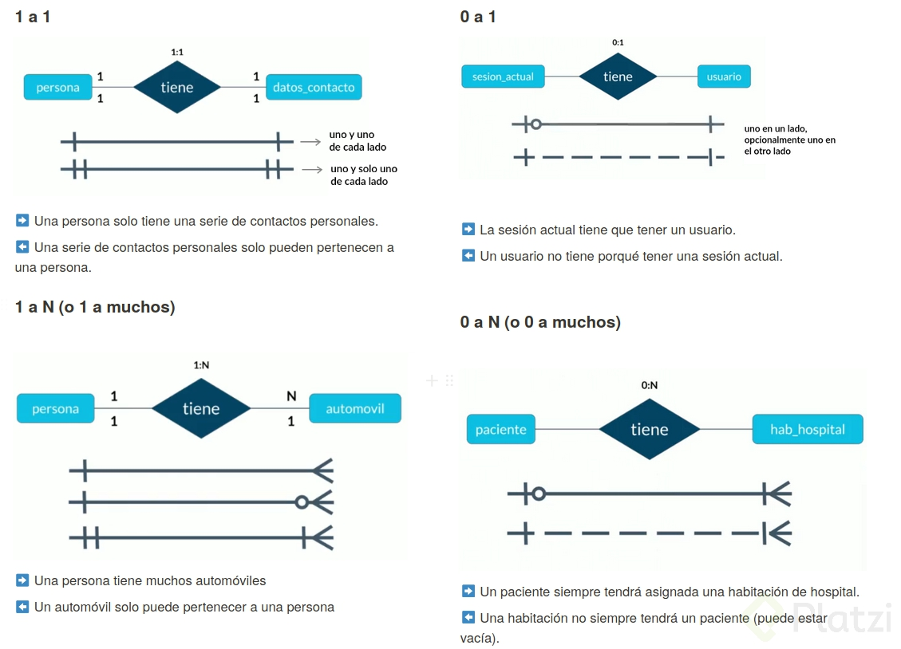

# DATABASE

# Base de datos relacional

Una base de datos relacional se basa en la organización de la información en pequeñas unidades relacionadas entre sí mediante identificadores. Utiliza el lenguaje SQL y permite establecer relaciones entre tablas a través de claves primarias y externas. Esto facilita la combinación de información de diferentes tablas mediante operaciones de unión.

Las bases de datos relacionales cumplen con el principio ACID (atomicidad, consistencia, aislamiento y durabilidad), lo que las hace robustas y menos vulnerables a fallos. Estas propiedades garantizan que las transacciones se realicen de forma completa, manteniendo la integridad de los datos y asegurando que los cambios sean duraderos.

Entre las bases de datos relacionales más populares se encuentran MySQL, Oracle, SQL Server y PostgreSQL, que son ampliamente utilizadas en el ámbito informático. Estas bases de datos ofrecen una amplia gama de características y funcionalidades para gestionar grandes volúmenes de datos de manera eficiente y segura.

# Base de datos no relacional

Una base de datos no relacional, también conocida como base de datos NoSQL (Not Only SQL), es un tipo de sistema de gestión de bases de datos que difiere del modelo relacional, ya que no utilizan identificadores para relacionar conjuntos de datos. En su lugar, los datos se organizan generalmente en documentos, lo que permite una mayor flexibilidad cuando no se tiene un esquema predefinido.

Las bases de datos no relacionales han ganado popularidad recientemente, y MongoDB lidera este éxito, seguida de cerca por Redis, Elasticsearch y Cassandra. Estas bases de datos ofrecen soluciones eficientes y escalables para el almacenamiento y procesamiento de datos en entornos con volúmenes masivos y cuando se requiere flexibilidad en la estructura de datos.

# Entidades y Atributos

* Entidad: es un objeto que existe y es distinguible de otros objetos (se encierra en un recuadro)
* Atributos: Características o propiedades que describen a la entidad (se encierra en un ovalo)
* Atributo multivaluado: Tiene un conjunto de valores para una entidad (Se encierra en un doble ovalo)
* Atributo compuesto: Se puede dividir en subpartes (es decir, en otros atributos) (de él salen otros atributos)
* Atributo especial o derivados: Su valor se puede obtener a partir de valores de otros atributos (se encierra en un ovalo punteado)
* Atributos llave: Característica o propiedad única de la entidad, lo que lo diferencia de los demás
    * Atributos llave naturales: Son parte de la entidad y no se pueden separar.
    * Atributo llave artificial: No son partes de la entidad y se les asignan de manera arbitraria para facilitar el manejo de la información.

* Entidades fuertes- son entidades que pueden sobrevivir por si solo, tip: al leer la tabla sabes que son las entidades (se encierra en un recuadro)
* Entidades débiles – no puede existir sin una entidad fuerte, tip: al leer la tabla no puedes saber que son las entidades (se encierra en un recuadro doble)
    * Entidades débiles por identidad: es cuando solo se diferencian entre si por la clave de su entidad fuerte
    * Entidades débiles por existencia: se le da su propio ID para diferenciarse de la entidad fuerte

Ejemplo:

# Datos

* **CHAR(n)** es un tipo de dato que se utiliza para almacenar cadenas de caracteres de longitud fija. El número "n" especifica la cantidad máxima de caracteres que puede contener la columna CHAR.

* **VARCHAR(n)** es un tipo de dato utilizado para almacenar cadenas de caracteres de longitud variable. A diferencia de CHAR, que asigna un espacio fijo para cada valor, VARCHAR utiliza solo el espacio necesario para almacenar la cadena real. Si la cadena es más corta que la longitud máxima, no se desperdicia espacio con espacios en blanco adicionales. Esto permite un uso eficiente del almacenamiento.

* **TEXT** se utiliza para almacenar cadenas de texto de longitud variable sin una limitación específica en la longitud. Es ideal para almacenar contenido extenso, como párrafos largos o documentos extensos.

* **INTEGER** se utiliza para almacenar valores numéricos enteros. Representa números enteros positivos y negativos sin parte decimal.

    El tipo de dato INTEGER es comúnmente utilizado para almacenar valores como identificadores, contadores, y cualquier otra información que requiera representar cantidades enteras.

* Algunas variantes del tipo INTEGER incluyen **SMALLINT**, que representa enteros más pequeños, y **BIGINT**, que permite almacenar enteros más grandes.

* **DECIMAL(n, s)** se utiliza para almacenar valores numéricos decimales con una precisión fija. Los parámetros "n" y "s" especifican la longitud total y la cantidad de dígitos decimales permitidos, respectivamente.

    El parámetro "n" define la longitud total del número, incluyendo los dígitos decimales y enteros.

    El parámetro "s" indica el número máximo de dígitos decimales permitidos. Por ejemplo, en DECIMAL(8, 2), significa que se reservarán 8 dígitos en total para el número, se permiten hasta 2 dígitos decimales.

* **NUMERIC(n, s)** se utiliza para almacenar valores numéricos con una precisión fija. Los parámetros "n" y "s" especifican la longitud total y la cantidad de dígitos decimales permitidos, respectivamente.

    Este tipo de dato es ideal cuando se requiere una precisión exacta y no se toleran errores de redondeo. Se utiliza comúnmente para almacenar valores monetarios, tasas de interés y otros datos que requieren una precisión decimal 
    
* **DATE** se utiliza para almacenar fechas sin incluir información sobre la hora. Representa una fecha en formato 'YYYY-MM-DD', donde YYYY es el año, MM es el mes y DD es el día.

* **TIME** se utiliza para almacenar información de horas sin incluir la fecha. Representa una hora en formato 'HH:MI:SS', donde HH es la hora, MI son los minutos y SS son los segundos.

* **DATETIME o TIMESTAMP** se utilizan para almacenar información combinada de fecha y hora. Representan una combinación de fecha y hora en formato 'YYYY-MM-DD HH:MI:SS'.

    **DATETIME** generalmente tiene un rango de valores más amplio y puede almacenar fechas y horas desde el año 1000 hasta el año 9999. Por otro lado, el tipo de dato **TIMESTAMP** suele tener un rango de valores más limitado y está sujeto a la precisión del reloj del sistema o a las restricciones establecidas por el sistema de gestión de bases de datos.

* **BOOLEAN** se utiliza para almacenar valores lógicos de verdadero o falso. Es ideal para expresar condiciones binarias y representar información de activado/desactivado, sí/no, verdadero/falso, entre otros.

# Relaciones

Las relaciones, representadas por un rombo, sirven para crear relaciones entre entidades. Por convención las relaciones son verbos que conectan entidades. Existen entidades multivaluadas o compuestas que tienen vida propia y se relacionan con otras entidades, por lo que se pueden normalizar (concepto que se explicará luego)

# Cardinalidad

Es una propiedad de las relaciones que indica la cantidad y correspondencia con la que puede estar relacionada una entidad y puede ser uno a uno, uno a varios, varios a uno y varios a varios.

