# ¿Que es PHP?

PHP es un lenguaje de scripting de uso general que es especialmente adecuado para el desarrollo web.

* Del lado del servidor.
* Hypertext Preprocessor.

**De proposito general**
* codigo en el servidor
* comandos para la terminal
* aplicaciones de escritorio

**De alto nivel**  
**Lenguaje interpretado**  
**Tipado debil**

## PHP es Ia mayoria del Internet

Según las estadisticas de W3Techs, PHP está en el 79% de todos los sitios web del mundo.

Tan solo el 53.4% usan su versión 7.

El 30% de los sitios de todo internet están construidos con WordPress (el CMS de PHP).

# ¿Como interactua una pagina web con tu back-end?

## Modelo cliente y servidor
Toda nuestra aplicación está guardada en un servidor, el cual entrega una copia de  a misma a cada cliente que la solicite.

Además, el servidor también se encarga de responder cada solicitud del usuario.


## Servidor físico o VPS
Es la computadora que se encarga de guardar tu página web y mantener accesible 24/7. Se le conoce como servidor y siempre está conectado a internet.

A través de él podemos definir ciertas reglas de seguridad para nuestra página.


## Servidor web
Es un programa que corre dentro de nuestro servidor físico y se encarga de gestionar cualquier petición que llegue al mismo.

Esta petición es procesada por algún lenguaje de programación y al final devuelve una respuesta.


## Métodos HTTP


Los métodos HTTP son una forma de comunicación entre el cliente y el navegador. A través de una solicitud HTTP el cliente es capaz de pedirle al servidor que realice una acción


## GET
Este método permite solicitar información al servidor. Por ejemplo, podemos pedirle una lista de productos en el caso de que estemos haciendo un e-commerce o una lista de software como adobe

## POST
Este método permite guardar información. Por ejemplo, podemos recabar datos del usuario desde un formulario y mandarlos a nuestro servidor para procesarlos.

podríamos guardarlos para armar una base de datos de usuarios o incluso un sistema de login.

## PUT/PATCH
Estos métodos permiten actualizar información ya guardada. Por ejemplo, podemos darle la oportunidad a un usuario de actualizar su correo electrónico o incluso cambiar su contraseña.

La diferencia es que PUT reemplaza toda la información existente y PATCH solo reemplaza lo necesario, es decir, “parcha” la información

## DELETE
Este método lo usamos para eliminar un recurso del servidor. Por ejemplo, podemos usarlo si deseamos eliminar un blogpost o un comentario.

Esto no significa que dejamos eliminarlo necesariamente dentro de nuestra base de datos, podemos hacer un “Soft delete”.


# Sintaxis

## ¿Que es una sintaxis?
Según la definición de Wikipedia:

"La sintaxis es la parte de la gramática que
estudia las reglas y principios que gobiernan la
combinatoria de constituyentes sintácticos y la
formación de unidades superiores a estos, como
los sintagmas y Ias oraciones gramaticales."


# en palabras más sencillas...
Son las reglas que dictan cómo se debe estructurar un lenguaje para que tenga sentido lo que decimos.

## ✖️ Yo querer taco carne mucha.

## ✅ Yo quiero un taco con mucha carne

# Ejemplo de sintaxis PHP
```php
<?php

echo "Hola mama estoy programando en php <br>";

$nombre="Carlos";
$apellido="Santana";

echo "No, no. Yo me llamo " . $nombre ." ". $apellido

?>
```

Resultado:


## Ejemplo de operaciones:

```php
<?php

// echo "Hola mamá estoy programando en php\n";

$nombre="Carlos";
$apellido="Santana";

//echo "No, no. Yo me llamo " . $nombre ." ". $apellido

//echo "No, no. Yo me llamo $nombre $apellido"

echo "El resultado de 4 x 5 es: " . 4*5;

?>
```
Resultado:

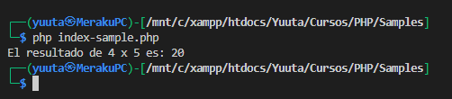

# Variables y Constantes

## ¿Que es una variable?

Es algo que varia, es decir, es capaz de guardar cualquier cosa en su interior y puede modificar, sustituir o eliminar dicho elemento que esté guardando en cualquier momento.


## ¿Que es una constante?

Es algo que nunca cambia, es decir, una vez que se le asigne un valor ya no  es posible modificarlo ni sustituirlo.

Una constante siempre mantendrá su valor intacto desde el momento en que se declara.


# Tipos de datos

Un tipo de dato simplemente es una forma de diferenciar los datos que  tenemos por medio de su tipo.

Por ejemplo, si es un nümero, una letra, una palabra, etc.

En programación podemos tener varios tipos de datos, pero los mås conocidos son...
* **Numéricos**
    * Integer
    * Float
    * Double
* **Cadenas de caracteres**
    * Char
    * String
* **Booleanos**
    * Bool
* **Sin valor**
    * Null
    * Undeflned

PHP tiene tipado débil, pero eso no significa que no use tipos de datos.

Este lenguaje no necesita que definas de forma explicita un tipo de dato, ya que por si mismo puede deducir qué tipo de dato estás usando.

## Conversión de tipos automática
PHP es capaz de convertir un tipo de dato a Otro de forma automática según el contexto donde se use.

Si sumas un número con un string, PHP evaluará ambos como números.

**Ejemplo:**

```php
<?php

$cadena = "4 litros";
$numero = 10;

echo$cadena + $numero, PHP_EOL;

?>
```

**Resultado:**


# Casting
## ¿Qué es eI casting?

Casting es cuando forzamos que un tipo de dato se convierta en Otro tipo de dato.

Ejemplo:

```php
$numerito = "5";

var_dump( $numerito );

$numerito = (int) $numerito;

var_dump( $numerito );
```

Resultado:

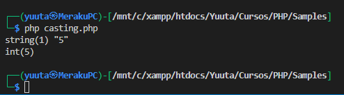

## Reto!!

```php
<?php
//Fácil

$nombre = "Carlos";
$apellido = "Gómez";
$edad = 18;
$aprobado = true;

//Medio

$promedio = (8 + 9.5 + 9 + 10 + 8) / 5;
$nombre_completo = $nombre . " " . $apellido;
$presento_examen = (bool) 1;

//Avanzado

$numero_preguntas = 5 + "5";
$numero_respuestas = "5" + 5;
$promedio_maximo = $numero_respuestas / 1.0;
$michis = 3 + "5 michis";

?>
```

# Operadores logicos

Son los operadores que nos ayudan a combinar dos o más afirmaciones para definir si una oración es cierta o falsa.

Su uso está basado en las tablas de verdad.

En la mayoria de sus usos se necesitan al menos dos afirmaciones y un operador:

**"Los michis son felinos y tienen 4 patas"**

## **Y (And)**


Se usa para verificar si dos afirmaciones son ciertas. Si ambas afirmaciones son ciertas, entonces la oración completa es cierta. Si una de ellas es falsa, entonces la oracion completa es falsa.

```php
<?php
// Operador &&
Echo 'Operador && (Y): ';
	$resultado = 7>3 && 10>3 && 12<1;
	var_dump($resultado);
echo '<br>';
?>
```

## **O (or)**


Se usa para verificar si al menos una afirmación es cierta.
Si al menos una de ellas es cierta, entonces la oración es cierta, de lo contrario, es falsa.

```php
<?php
// Operador ||
Echo 'Operador || (O): ';
	$resultado = 7>3 || 10>3 || 12<1;
	var_dump($resultado);
echo '<br>';
?>
```

## **No (Not)**


Se usa para invertir el valor de una afirmación.

```php
<?php
// Operador NOT
Echo 'Operador ! (NOT): ';
	$resultado = !7>3;
	var_dump($resultado);
?>
```
**¡Reto!**

```php
// Suponiendo estas variables
$es_un_michi_grande = true;
$le_gusta_comer = true;
$sabe_volar = false;
$tiene_2_patas = false;

// ¿Cual es el resultado?
$es_un_michi_grande && $le_gusta_comer;
$es_un_michi_grande || $sabe_volar;
$sabe_volar || $tiene_2_patas;
!$le_gusta_comer;
!$le_gusta_comer || $es_un_michi_grande;
```
Resultado:

```php
// Suponiendo estas variables
$es_un_michi_grande = true;
$le_gusta_comer = true;
$sabe_volar = false;
$tiene_2_patas = false;

// ¿Cual es el resultado?
$es_un_michi_grande && $le_gusta_comer; // true
$es_un_michi_grande || $sabe_volar; // true
$sabe_volar || $tiene_2_patas; // false
!$le_gusta_comer; // false
!$le_gusta_comer || $es_un_michi_grande; // true
```
# Operadores aritmeticos


### [Sample Operadores aritmeticos](../Samples/operadores-aritmeticos.php)

# Operadores Relacionales

Son los operadores que nos ayudan a comparar
dos valores.

### [Sample Operadores relacionales](./Samples/operadores-relacionales.php)


Operador Descripción

=	Asignación

+=	Incremento

++	Incremento

-=	Decremento

--	Decremento

*=	Multiplicación

/=	División

.=	Concatenación

### [Otros operadores](./Samples/otros-operadores.php)

PHP también posee otros operadores importantes y muy usados como los de asignación, incremento/decremento y concatenación.

Operador de asignación
Representado por el signo = se usa para asignarle un valor determinado a una variable o constante:

```php
<?php
$a = 100;
$b = 50 + 30;
```

Este no se debe leer como “igual a” pues para expresar igualdad tenemos otros operadores como == (igual a) o === (idéntico a).

Operadores de incremento/decremento
Estos operadores solo afectan a números y strings, pero no arrays, objects ni resources. Además, decrementar valores null tampoco tiene efecto, sin embargo, incrementarlos resulta en 1.

Operador de incremento
Representado por la secuencia de signos += son operadores utilizados para abreviar la forma en que incrementamos el valor de una variable. Veamos la siguiente línea de código:

```php
<?php
$contador = 0;
$contador = $contador + 10;

echo $contador;

echo "\n";
#-----------------------
# Mensaje en pantalla:
# 10
```

Esta puede ser simplificada usando un operador de incremento:

```php
<?php
$contador = 0;
$contador += 10;

echo $contador;

echo "\n";
#-----------------------
# Mensaje en pantalla:
# 10
```

Si solo queremos incrementar en 1 nuestra variable podemos abreviar el código aún más:

```php
$contador = 0;
$contador++;

echo $contador;

echo "\n";
#-----------------------
# Mensaje en pantalla:
# 1
```

La secuencia ++ es otro operador de incremento que nos permite solo incrementar en una unidad nuestra variable.

Operador de decremento
Es la contraparte delos operadores de incremento.
Están representadas por -= y -- en donde la primera puede decrementar en más de una unidad, pero la segunda solo nos permite reducir en 1 el valor de nuestra variable:

```php
$contador_1 = 100;
$contador_1 -= 10;

$contador_2 = 10;
$contador_2--;

echo "El contador 1 es igual a $contador_1 \n";
echo "El contador 2 es igual a $contador_2 \n";

#-----------------------
# Mensaje en pantalla:
# El contador 1 es igual a 90
# El contador 2 es igual a 9
```

Válido también para la multiplicación y división
Estos operadores están representados por la secuencia de signos *= y /=:

```php
<?php
$contador_1 = 5;
$contador_1 *= 10;

$contador_2 = 1000;
$contador_2 /= 2;

echo "El contador 1 es igual a $contador_1 \n";
echo "El contador 2 es igual a $contador_2 \n";

#-----------------------
# Mensaje en pantalla:
# El contador 1 es igual a 50
# El contador 2 es igual a 500
```

Operadores de concatenación

Su funcionamiento es similar a los operadores de incremento/decremento.
Son normalmente empleados para concatenar variables de tipo String con otras cadenas de caracteres.
Es representado por la siguiente secuencia: .= .

```php
<?php
$nombre = "Carlos";
$nombre .= " " . "Santana";
# Esto es lo mismo que: $nombre = $nombre . " " . "Santana";

echo $nombre;
echo "\n"; # Salto de línea
#-----------------------
# Mensaje en pantalla:
# Carlos Santana
```

### [Precedencia](../Samples/precedencia.php)

En pocas palabras, la precedencia de operadores es cuando el lenguaje nos dice qué operación pasará primero y qué operación pasará después de acuerdo al operador. Por ejemplo:

```php
<?php

$operacion = 1 + 5 * 3;
```

¿Primero suma y luego multiplica? O ¿Primero multiplica y luego suma?

La respuesta es:
primero multiplica y luego suma, por lo que nuestra variable $resultado valdrá 16. Esto es debido a que la multiplicación tiene mayor precedencia que la suma.

## La asociatividad

Cuando los operadores tienen la misma precedencia, su asociatividad elige si se resuelve la instrucción a partir de la derecha o desde la izquierda.

```php
<?php

// Tiene asociatividad de izquierda:
echo 1 - 2 - 3;
```

Observamos que se usa un mismo operador, por tanto, el nivel de precedencia va a ser igual. La asociatividad de “-” es de izquierda, en consecuencia, primero resolverá la resta 1 - 2 y luego restará 3.

```php
<?php

echo 1 - 2 - 3;

/*
Veamos como serían los estados de la operación ayudándonos del uso de paréntesis:

echo 1 - 2 - 3;

echo (1 - 2) - 3;

echo -1 - 3;

echo (-1 - 3);

echo -4
*/
```

Ahora un ejemplo con asociatividad de derecha:

```php
<?php

$c = 10;

$a = $b = $c;

echo $a; # 10
echo “\n”; # Salto de línea

/*
Primero la variable $b se iguala al valor de la variable $c y luego resultado se iguala a la variable $a:

$a = $b = $c

$a = ($b = $c)

$a = (10)

$a = 10

Finalmente, se imprime en pantalla el número 10, pues este es el valor de la variable $a.
*/
```

Tabla de precedencia y asociatividad en PHP

Observemos mediante una tabla la precedencia (los de más alta estarán al inicio) y asociatividad de los operadores en PHP:

Tabla de precedencia y asociatividad de operadores

Problemas con la precedencia
Hay ocasiones en la que la precedencia y asociatividad de los operadores nos puede jugar en contra provocando resultados no deseados. Por ejemplo, si en una evaluación AND una de las afirmaciones es falsa, el resultado será falso (false):

```php
<?php

$michis_4_patas = true;
$michis_programan_con_PHP = false;

$resultado = $michis_4_patas and $michis_programan_con_PHP;

var_dump( $resultado ); # Imprimimos en pantalla el valor de la variable $resultado

echo “\n”; # Salto de línea

# Mensaje en consola:
# bool(true)
```

Sin embargo, si ejecutamos este código nos aparecerá en pantalla el valor de true. Esto es debido a que la asociatividad del operador and es de izquierda y hará que primero la variable `$resultado` se iguale al valor de `$michis_4_patas` el cual es true, por ello cuando queramos imprimirlo en consola nos dirá que el valor de $resultado es true:

```php
<?php

$michis_4_patas = true;
$michis_programan_con_PHP = false;

$resultado = $michis_4_patas and $michis_programan_con_PHP;

/*
Usemos unos paréntesis para entender que fue lo que pasó:

($resultado = $michis_4_patas) and $michis_programan_con_PHP;

A la variable $resultado se le asignará el valor de la variable $michis_4_patas:

$resultado = true;
*/

var_dump( $resultado ); # Se imprimirá true en pantalla
echo “\n”; # Salto de línea
```

Forzando la evaluación

Una solución para los problemas que podemos tener con la precedencia y su asociatividad, es el uso de paréntesis en las operaciones que no queremos que se vean afectadas. Arreglemos el ejemplo anterior:

```php
<?php

$michis_4_patas = true;
$michis_programan_con_PHP = false;

$resultado = ($michis_4_patas and $michis_programan_con_PHP);

var_dump( $resultado ); # Imprimimos en pantalla el valor de la variable $resultado

echo “\n”; # Salto de línea

# Mensaje en consola:
# bool(false)
```

Los paréntesis forzarán a realizar la evaluación que este dentro. Por ello es que la variable `$resultado` ya no es igualado al valor de `$michis_4_patas` directamente, sino que tomará el resultado de la evaluación `AND` entre `$michis_4_patas` y `$michis_programan_con_PHP` y como uno de estas variables es falsa, el valor final será false.

# Arreglos

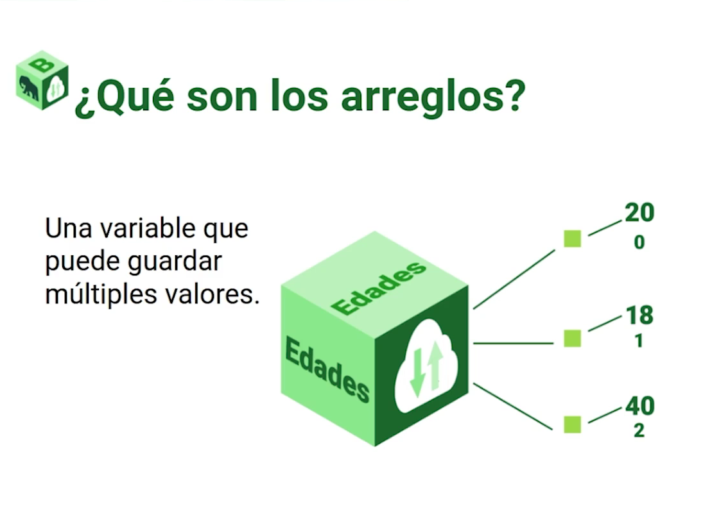

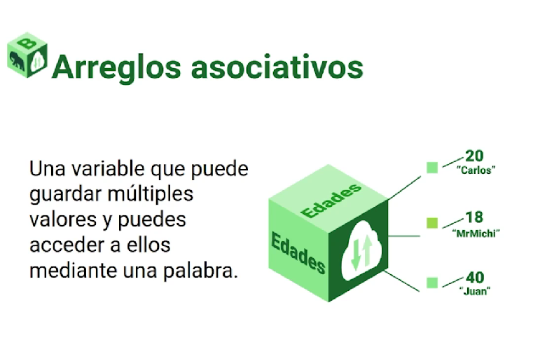

Manera gráfica de un arreglo:


Ejemplos:

```php
#Primer forma
$frutas = array("pera", "manzana", "uva", 2)
#Desde este tipo podemos acceder segun el indice 

#Segunda forma
$frutas = ["Uva","Pera","Sandia"];
#Desde este tipo podemos acceder segun el indice 

#Arreglo Asociativo
$joe = array('name'=>'Jose','age'=>25,'country'=>'mexico');
#Para acceder a este tipo debemos hacerlo de lasiguente forma $nameArray['namePropiedad']
```
# Estructuras de control

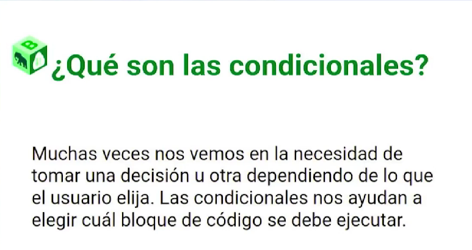


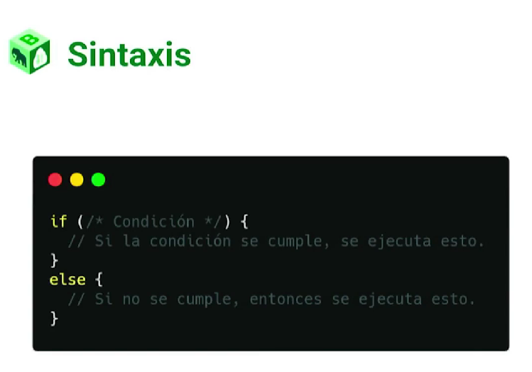

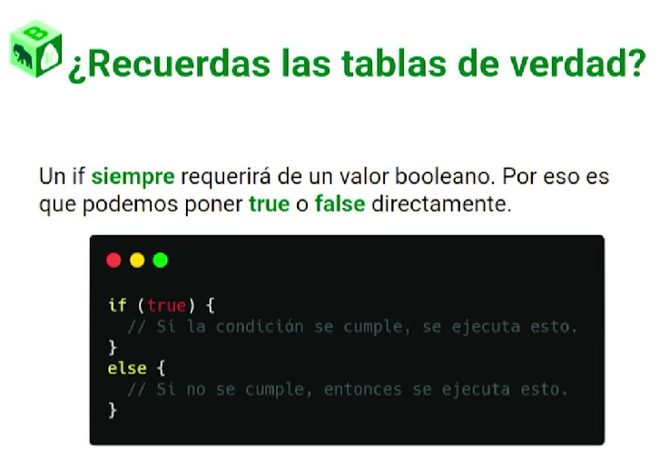

Ejemplo:

```php
<?php

$asientos_disponibles = 0;

if ($asientos_disponibles > 0){
    echo "Puedes ver la pelicula de Spidey";
}
else {
    echo "Lo sentimos, te tocara spoilearte";
}
echo "\n";
```
# Switch

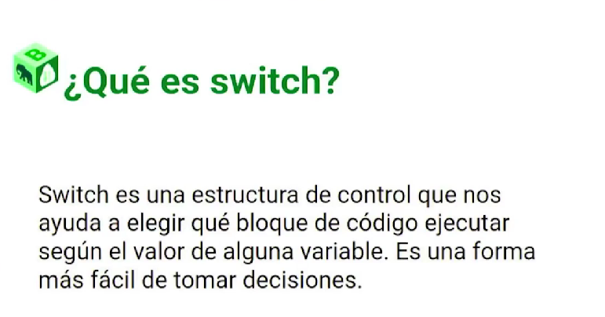

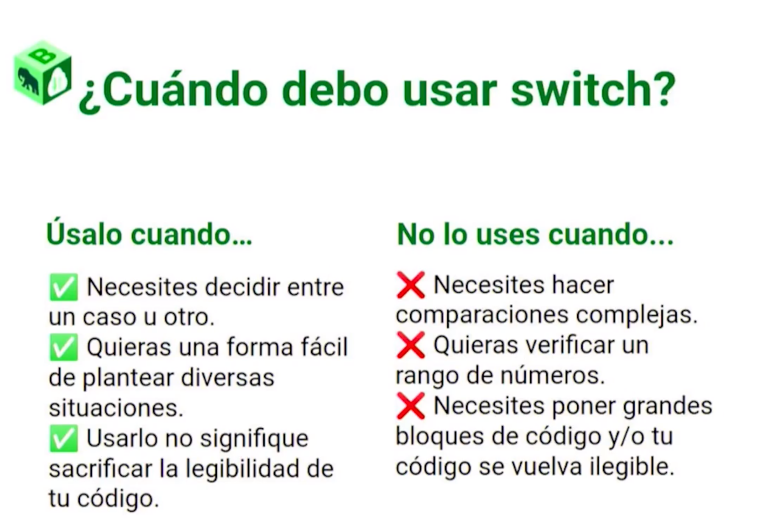

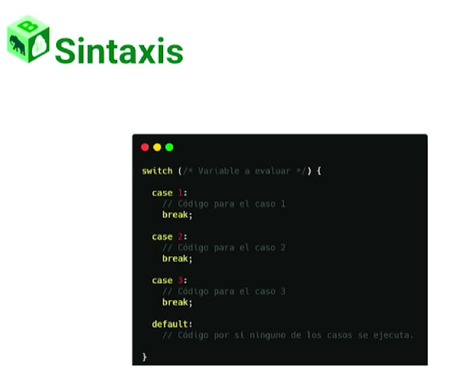

Ejemplo:

```php
// Michi 1: 9
// Michi 2: 4
// Michi 3: 3
// Michi 4: 9
// Michi 5: 1

$michi = 1;

switch( $michi ){
    case 4:
        echo "Su numero favorito es el 9";
        break;

    case 2:
        echo "Su numero favorito es el 4";
        break;

    case 3:
        echo "Su numero favorito es el 3";
        break;

    default:
        echo "Ese michi no existe :c";

}

echo "\n";
```

# Bucles

# While

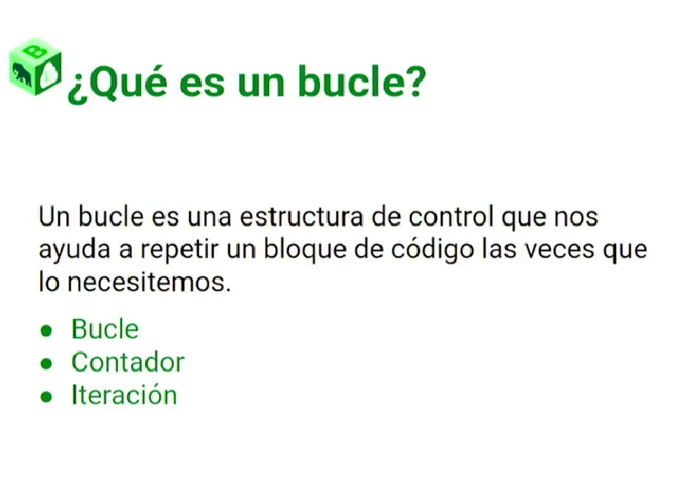

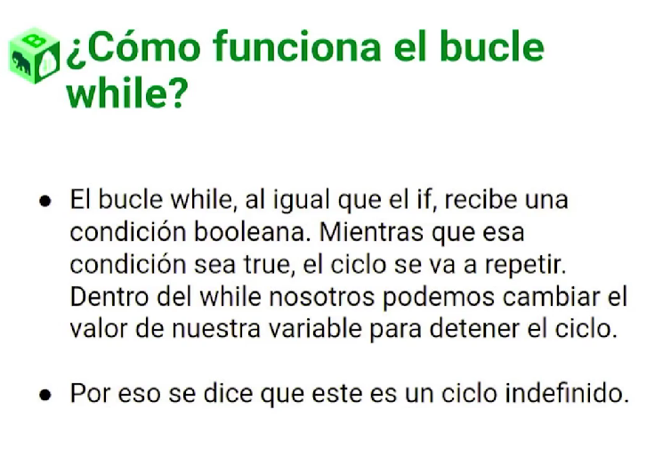

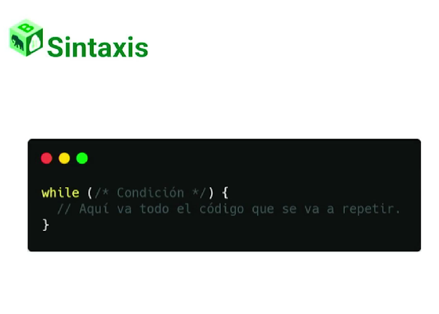

Ejemplo:

```php
<?php

$contador = 1;
$maximo = 10;

while ($contador <= $maximo) {
    echo "el contador está en {$contador}\n";
    $contador++;
}
```

# Do While

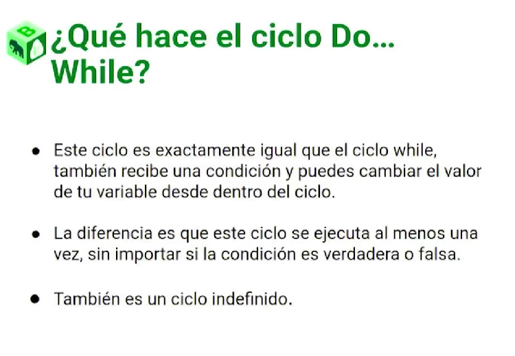


Ejemplo:

```php
<?php 
$usernames = ["salem", "atzin"];
do {
    $username = readline("Ingresa tú nombre de usuario: ");
} 
while (in_array($username, $usernames));
    echo "Hola $username";
?>
```
# Ciclo FOR

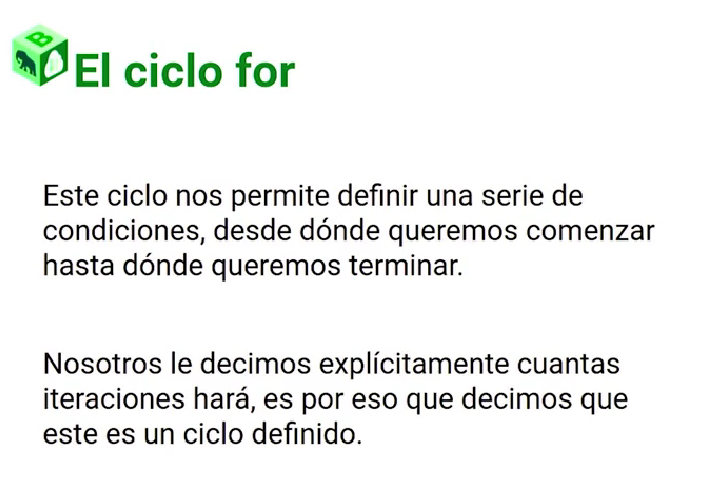

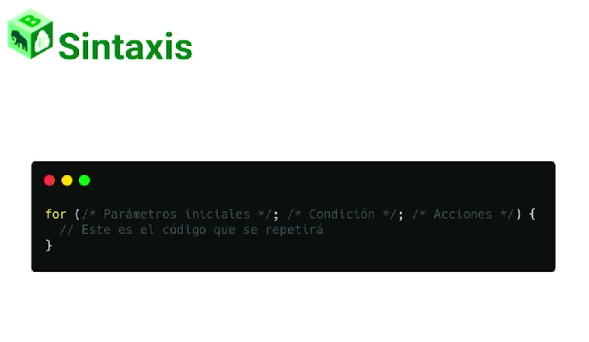

Ejemplo:
```php
<?php
$michis = array (
    "MichiJuan",
    "MichiBerto",
    "Mr.Michi",
    "MichiMouse",
    "PepeMichi",
    "MichiMan",
    "MichiMe",
);
for ($i=0; $i <= count($michis) - 1 ; $i++) {     
    echo $i . "- " . $michis[$i] . "\n";
}
?>
```
# Ciclo Foreach

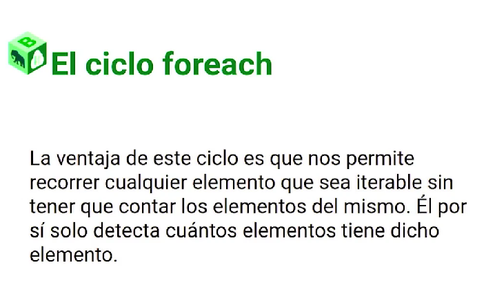

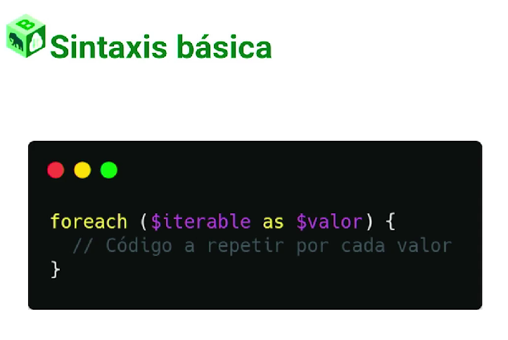

Ejemplo:

```php
<?php

    $cafes=array(
        "Capuccino"=>50,
        "Latte"=>45,
        "Americano"=>40,
        "Te chai"=>45
    );

    echo"\n\t Lista de cafés y precios:";
    foreach($cafesas$tipo => $costo){
        echo"\n\t El café $tipo cuesta: $$costo";
    }
    
    $cafe=readline("\nEscribe un cafe para buscarlo: ");

    foreach($cafesas$tipo => $costo){
        if($tipo == $cafe){
            echo"\n\t Café tipo: $tipo encontrado";
            echo"\n\t Costo: $$costo";
            break;
        }
    }

    echo"\n\n";

?>
```

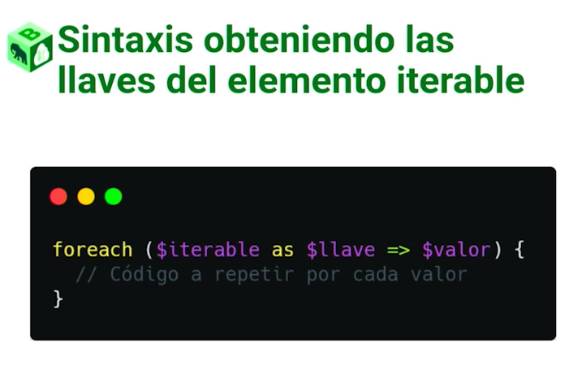

Ejemplo:

```php
<?php

$tiendita_de_cafes = array(
    "Americano" => 20,
    "Latte" => 25,
    "Capuccino" => 27.5,
    "Mocca" => 24
);

foreach ($tiendita_de_cafes as $cafe => $price)
    echo "El café $cafe cuesta $$price USD \n";


echo "\n";
?>
```

# ¡Reto!


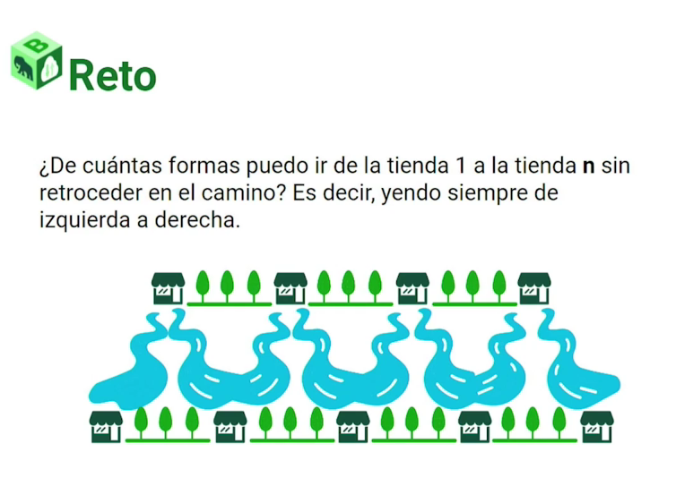

### Mas simplificado...


Usa esto de ejemplo:


# Funciones


Ejemplo:

```php
<?php 
function suma($numero1, $numero2){
    echo $numero1 + $numero2;
}

suma(2,3);

?>
```
# Parametros

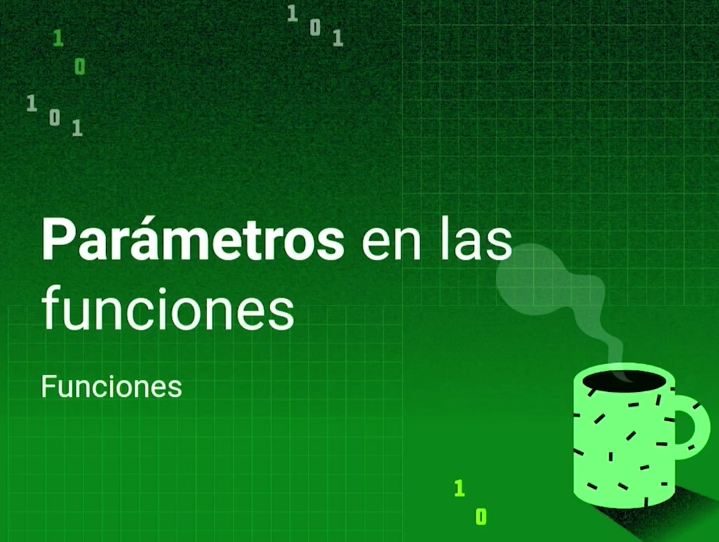

## [Parametros.php](../Samples/parametros-funciones.php)

## [Profundizando en parametros.php](../Samples/profundizando-parametros.php)

# Return


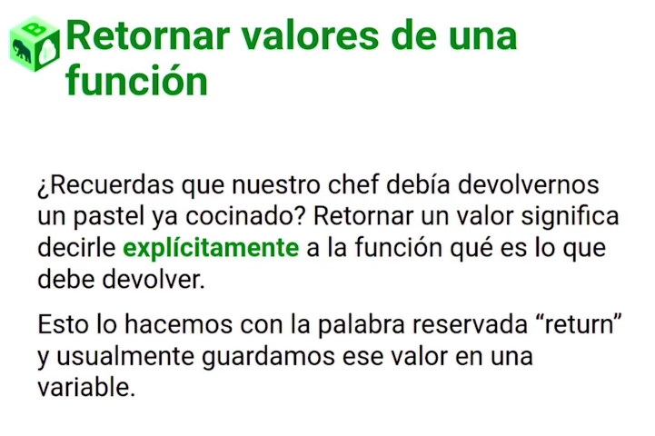

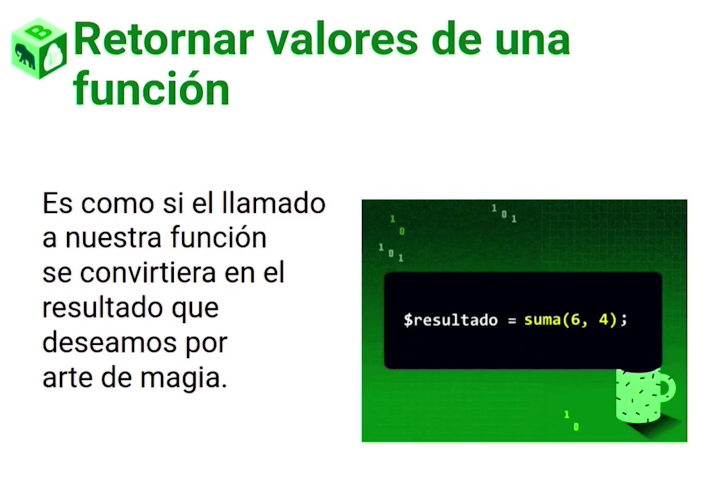

# Mas funciones prestablecidas

Uno de los mejores ejemplos es la funcion de cookies

## [Documentación cookies](https://www.php.net/manual/es/reserved.variables.cookies.php)

# Cookies

Las cookies son pequeños archivos de texto que se almacenan en el navegador web del usuario. Estos archivos contienen información específica que se utiliza para realizar un seguimiento del comportamiento del usuario en un sitio web.

Ejemplo:

Puedes usar la función `setcookie()` para establecer una cookie en PHP. Esta función acepta varios parámetros, siendo los más comunes el nombre de la cookie y su valor.

```php
setcookie("nombre_cookie", "valor_cookie", tiempo_expiracion);
```
* `"nombre_cookie"`: Especifica el nombre de la cookie.
* `"valor_cookie"`: Especifica el valor de la cookie.
* `tiempo_expiracion` (opcional): Define el tiempo de expiración de la cookie. Puedes establecer un tiempo en segundos desde el momento actual o dejarlo en blanco para que la cookie se elimine cuando se cierre el navegador.

Puedes acceder al valor de una cookie utilizando la variable global `$_COOKIE`. Esta variable es un array asociativo que contiene todas las cookies establecidas en la página actual.

```php
$valor = $_COOKIE["nombre_cookie"];
echo $valor;
```

Puedes utilizar la función `isset()` para verificar si una cookie está establecida antes de acceder a su valor.

```php
if (isset($_COOKIE["nombre_cookie"])) {
    // La cookie está establecida
    // Realiza alguna acción
} else {
    // La cookie no está establecida
    // Realiza otra acción
}
```

Puedes eliminar una cookie estableciendo su tiempo de expiración en un valor pasado.

```php
setcookie("nombre_cookie", "", time() - 3600);
```

En este caso, la cookie se establece con un tiempo de expiración en el pasado, lo que hace que el navegador la elimine.

[Cookies.php](./Samples/cookies.php)

# Convertir mayusculas y minusculas

En PHP, puedes utilizar la función `strtoupper()` para convertir un texto a mayúsculas. Esta función toma como parámetro una cadena de texto y devuelve esa cadena convertida a letras mayúsculas.

```php
$texto = "Hola, mundo!";
$textoMayusculas = strtoupper($texto);

echo $textoMayusculas; // muestra "HOLA, MUNDO!"
```

Si deseas convertir solo la primera letra de cada palabra a mayúsculas, puedes utilizar la función `ucwords()` en su lugar.

`strtolower()` para convertir un texto a minúsculas.

# Reordenar arreglos

En PHP, puedes utilizar la función `sort()` para ordenar los elementos de un arreglo de forma ascendente. Esta función modifica el arreglo original, reordenando los elementos en su lugar.

```php
$frutas = array("manzana", "naranja", "plátano", "uva");
sort($frutas);

print_r($frutas);
```

`print_r()` se utiliza para imprimir el arreglo resultante.

`rsort()` para ordenar los elementos de un arreglo en orden descendente.

```php
$nums = array(5, 2, 9, 1, 7);
rsort($nums);

print_r($nums);
```

`count()` para contar los elementos de un arreglo.

```php
$frutas = array("manzana", "naranja", "plátano");
$total = count($frutas);

echo $total; // muestra "3"
```

