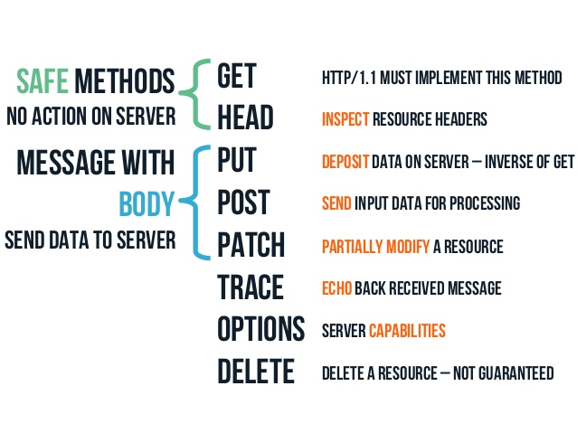
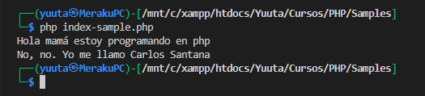
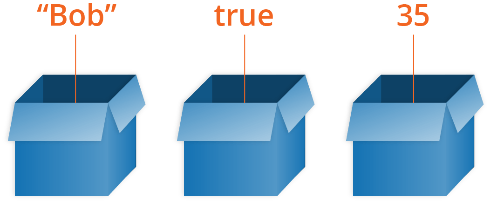
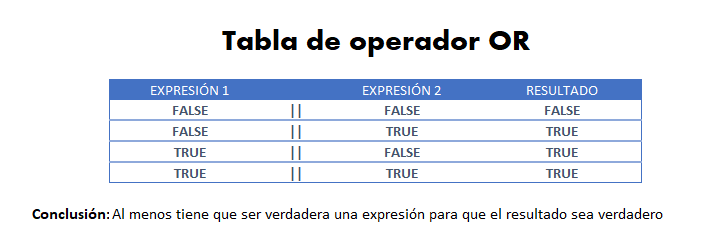
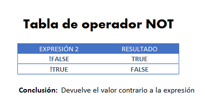
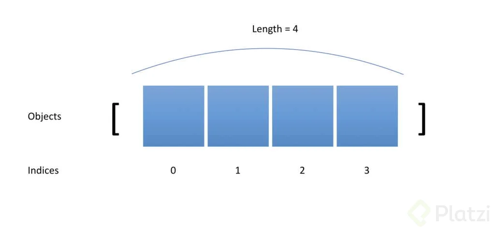
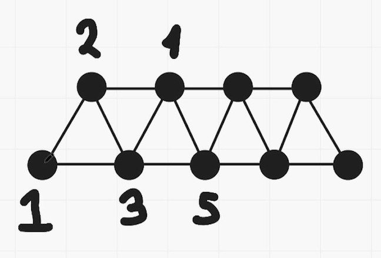
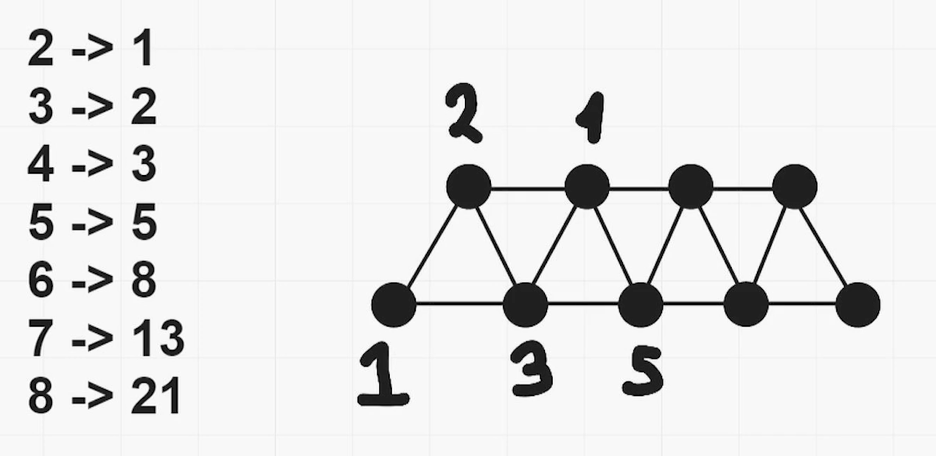
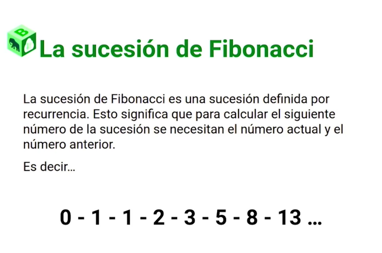

# PHP

¡Bienvenidos, jóvenes programadores! En este curso, nos sumergiremos en el fascinante mundo de la programación con PHP. ¿Estás listo para explorar cómo funciona la web desde el lado del servidor? ¡Vamos a aprender juntos!

# ¿Que es PHP?

PHP, conocido como Hypertext Preprocessor,  es un lenguaje de programación que se usa para crear sitios web dinámicos e interactivos. Con PHP, puedes comunicarte con una base de datos, procesar información del usuario, enviar correos electrónicos y mucho más.

PHP se ejecuta en el lado del servidor, es decir, en el ordenador que aloja el sitio web. El servidor recibe las peticiones del cliente, que es el navegador web que usa el usuario para acceder al sitio web, y le envía las respuestas en forma de páginas web. El cliente y el servidor se comunican mediante el protocolo HTTP, que es el lenguaje estándar de la web.

#### PHP es Ia mayoria del Internet

Es utilizado en una gran cantidad de aplicaciones web populares como WordPress, Facebook y Wikipedia.
Según las estadisticas de W3Techs, PHP está en el 79% de todos los sitios web del mundo.

Tan solo el 53.4% usan su versión 7.

El 30% de los sitios de todo internet están construidos con WordPress (el CMS de PHP).


El frontend y el backend son las dos partes que componen un sitio web. El frontend es la parte visible del sitio web, lo que el usuario ve y con lo que interactúa. El frontend se compone de HTML, CSS y JavaScript, que son los lenguajes que el navegador puede interpretar. El backend es la parte oculta del sitio web, lo que el usuario no ve pero que hace que el sitio funcione. El backend se compone de PHP y una base de datos, que son los lenguajes que el servidor puede interpretar.

## ¿Qué es un Servidor Web?

Un servidor web es un programa informático diseñado para procesar solicitudes HTTP de clientes, como navegadores web, y entregarles recursos, como páginas web u otros archivos. Actúa como el anfitrión de los sitios web, gestionando y distribuyendo contenido a través de internet.


### PHP y la Funcionalidad del Servidor Web

PHP, aunque conocido principalmente como un lenguaje de programación del lado del servidor, tiene una estrecha relación con los servidores web. Se utiliza comúnmente en la creación de sitios web dinámicos y aplicaciones web, ya que puede ejecutarse en servidores web compatibles con PHP, como Apache, Nginx, entre otros.

```php
// Ejemplo básico de PHP en un archivo index.php ejecutado en un servidor web

<?php
    // Código PHP para generar contenido dinámico
    $mensaje = "¡Hola desde PHP en el servidor web!";
    echo $mensaje;
?>
```

En este ejemplo, el servidor web interpreta el código PHP presente en el archivo `index.php` y genera dinámicamente una página web que mostrará el mensaje "¡Hola desde PHP en el servidor web!".

## Servidor físico o VPS
Es la computadora que se encarga de guardar tu página web y mantener accesible 24/7. Se le conoce como servidor y siempre está conectado a internet.

A través de él podemos definir ciertas reglas de seguridad para nuestra página.


## ¿Qué es el Modelo Cliente-Servidor?

El modelo cliente-servidor es la base de la comunicación en la web. En este paradigma, la interacción se establece entre dos entidades principales:

- **Cliente:** El cliente es la interfaz de usuario o la aplicación que solicita recursos o servicios al servidor. Normalmente, un navegador web como Chrome, Firefox o Safari actúa como cliente.
- **Servidor:** El servidor es una poderosa máquina que almacena y procesa datos, respondiendo a las solicitudes del cliente. Aquí es donde reside la lógica de la aplicación y se almacenan los datos.


### Funcionamiento en PHP

PHP desempeña un papel vital en este modelo al ejecutarse en el servidor. El cliente solicita recursos o servicios al servidor, el cual utiliza PHP para procesar estas solicitudes y generar respuestas dinámicas.

```php
<?php
// Ejemplo básico de solicitud al servidor PHP desde un cliente

// Cliente (Navegador web, por ejemplo) hace una solicitud al servidor
// El servidor procesa la solicitud utilizando PHP

// Ejemplo de una página PHP que muestra un mensaje al cliente

    $mensaje = "¡Hola, Mundo!";
    echo $mensaje;
?>
```

En este ejemplo sencillo, el servidor interpreta el código PHP y envía la respuesta HTML generada al cliente, que finalmente mostrará el mensaje "¡Hola, Mundo!".

## Ventajas del Modelo Cliente-Servidor

Este modelo presenta una serie de ventajas fundamentales:

- **Escalabilidad:** Permite manejar múltiples clientes simultáneamente.
- **Centralización de la lógica:** La lógica de la aplicación reside en el servidor, lo que facilita su gestión y actualización.
- **Acceso global:** Los servicios ofrecidos por el servidor pueden ser accedidos desde cualquier lugar con conexión a internet.


### ¿Qué es HTTP y su Relación con PHP?

HTTP es el lenguaje que permite la comunicación entre un cliente (navegador web) y un servidor. Cuando ingresas una URL en tu navegador y presionas "Enter", estás enviando una solicitud HTTP al servidor. Este proceso permite cargar una página web, enviar formularios, realizar descargas y mucho más.

En el contexto de PHP, este lenguaje de programación es comúnmente utilizado en el lado del servidor para procesar estas solicitudes HTTP y generar respuestas dinámicas que se envían de vuelta al cliente.


Las solicitudes y respuestas HTTP están compuestas por diferentes partes:

- **Solicitud HTTP:** Cuando un navegador envía una solicitud al servidor, incluye varios elementos clave, como el método de solicitud (GET, POST, etc.), la URL solicitada y, en algunos casos, datos adicionales como parámetros o información del usuario.

- **Respuesta HTTP:** El servidor procesa la solicitud y envía de vuelta una respuesta. Esta respuesta incluye un código de estado (200 para éxito, 404 para página no encontrada, entre otros), encabezados (headers) que contienen información sobre el tipo de contenido, y finalmente, el cuerpo (body) que contiene el contenido real de la página o recurso solicitado.

En el desarrollo web con PHP, comprender y manejar las solicitudes y respuestas HTTP es esencial. PHP te permite acceder a estos elementos HTTP a través de variables superglobales como `$_GET`, `$_POST`, `$_REQUEST`, `$_SERVER`, entre otros. Estas variables te permiten acceder a los datos enviados por el cliente, información sobre el servidor y mucho más.

## ¿Qué son los Métodos HTTP?

Los métodos HTTP son acciones que se utilizan para indicar la intención de una solicitud al servidor. Los principales métodos son:

- **GET:** Solicita datos de un recurso específico. Usualmente se usa para obtener información.
- **POST:** Envía datos al servidor para ser procesados. Comúnmente utilizado para enviar información a través de formularios web.
- **PUT:** Actualiza datos de un recurso específico en el servidor.
- **DELETE:** Elimina un recurso específico en el servidor.
- **y otros métodos menos comunes como OPTIONS, PATCH, HEAD, etc.**



### Ejemplo de Uso en PHP

En PHP, estos métodos se pueden manejar y procesar según la solicitud recibida. Aquí hay un ejemplo básico que muestra cómo se puede acceder al método de solicitud en PHP:

```php
// Ejemplo básico de manejo de métodos HTTP en PHP

if ($_SERVER['REQUEST_METHOD'] === 'POST') {
    // Procesar datos enviados por POST
    $usuario = $_POST['usuario'];
    $contrasena = $_POST['contrasena'];
    
    // Realizar validaciones, guardar en base de datos, etc.
    // ...
    
    echo "¡Datos recibidos por método POST!";
} elseif ($_SERVER['REQUEST_METHOD'] === 'GET') {
    // Procesar solicitud GET
    echo "¡Solicitud recibida por método GET!";
} else {
    // Otros métodos (PUT, DELETE, etc.)
    echo "Método no soportado";
}
```

Este ejemplo muestra cómo PHP puede identificar y manejar diferentes métodos de solicitud HTTP, ejecutando acciones específicas según el tipo de método recibido.


## ¿Que es una sintaxis?
Según la definición de Wikipedia:

"La sintaxis es la parte de la gramática que
estudia las reglas y principios que gobiernan la
combinatoria de constituyentes sintácticos y la
formación de unidades superiores a estos, como
los sintagmas y Ias oraciones gramaticales."


**en palabras más sencillas...**
Son las reglas que dictan cómo se debe estructurar un lenguaje para que tenga sentido lo que decimos.

#### ✖️ Yo querer taco carne mucha.

#### ✅ Yo quiero un taco con mucha carne

## Ejemplo de sintaxis PHP
```php
<?php

echo "Hola mama estoy programando en php <br>";

$nombre="Carlos";
$apellido="Santana";

echo "No, no. Yo me llamo " . $nombre ." ". $apellido

?>
```

Resultado:



## Principales Elementos de la Sintaxis PHP

- **Variables:** Se declaran con un signo de dólar `$` seguido de un nombre y pueden almacenar diferentes tipos de datos.
- **Comentarios:** Se pueden agregar utilizando `//` para comentarios de una línea o `/* */` para comentarios de varias líneas.
- **Estructuras de Control:** Incluyen condicionales (`if`, `else`, `elseif`), bucles (`for`, `while`, `do-while`), entre otros.
- **Funciones:** Bloques de código reutilizable que se pueden invocar mediante su nombre.

## Importancia de la Sintaxis Correcta

La sintaxis correcta es crucial en PHP, ya que un error de sintaxis puede llevar a errores en la ejecución del programa. Algunos errores comunes incluyen olvidar un punto y coma al final de una línea, errores en la escritura de palabras clave como `echo`, `if`, entre otros.

## ¿Que es una variable?



Es algo que varia, es decir, es capaz de guardar cualquier cosa en su interior y puede modificar, sustituir o eliminar dicho elemento que esté guardando en cualquier momento.

En PHP, una variable es un contenedor para almacenar datos como números, cadenas de texto o cualquier otro tipo de información. A diferencia de otros lenguajes, PHP utiliza un prefijo `$` seguido del nombre de la variable para su declaración.

### Declaración y Asignación de Variables

```php
// Ejemplo básico de declaración y asignación de variables en PHP

$nombre = "Juan"; // Variable que almacena un nombre
$edad = 25; // Variable que almacena una edad
$precio = 19.99; // Variable que almacena un precio
$es_estudiante = true; // Variable que almacena un valor booleano

// Imprimir el contenido de las variables
echo "Nombre: " . $nombre . "<br>";
echo "Edad: " . $edad . "<br>";
echo "Precio: " . $precio . "<br>";
echo "¿Es estudiante? " . ($es_estudiante ? 'Sí' : 'No') . "<br>";
```

En este ejemplo, se declaran cuatro variables (`$nombre`, `$edad`, `$precio`, `$es_estudiante`) y se les asignan diferentes tipos de datos: una cadena de texto, un número entero, un número decimal y un valor booleano, respectivamente.

## Características Importantes de las Variables en PHP

- **Dinámicas:** En PHP, el tipo de dato de una variable puede cambiar durante la ejecución del programa.
- **Ámbito:** Las variables pueden tener diferentes alcances, como global, local o de ámbito de función.
- **Nombres de Variables:** Los nombres de variables en PHP son sensibles a mayúsculas y minúsculas, por lo que `$variable` y `$Variable` se considerarían diferentes.


## ¿Que es una constante?

Es algo que nunca cambia, es decir, una vez que se le asigne un valor ya no  es posible modificarlo ni sustituirlo.

En PHP, una constante es un identificador (nombre) para un valor que no puede cambiar durante la ejecución del script. A diferencia de las variables, las constantes una vez definidas no pueden ser modificadas ni redefinidas más adelante en el script.

### Declaración de Constantes en PHP

```php
// Sintaxis para definir una constante en PHP
define("PI", 3.1416);
const SALUDO = "¡Hola, mundo!";

// Accediendo al valor de las constantes
echo "El valor de PI es: " . PI . "<br>";
echo "El mensaje de saludo es: " . SALUDO . "<br>";
```

En este ejemplo, se definen dos constantes, `PI` con un valor de 3.1416 y `SALUDO` con el mensaje "¡Hola, mundo!". Una vez definidas, su valor no puede ser alterado durante la ejecución del programa.

## Características Importantes de las Constantes en PHP

- **No se pueden redefinir:** Una vez definida una constante, no se puede cambiar su valor.
- **Nombres de Constantes:** Se recomienda utilizar nombres en mayúsculas para las constantes por convención, aunque no es obligatorio.
- **Alcance:** Las constantes son globales por defecto y pueden ser utilizadas en cualquier lugar del script sin necesidad de importarlas explícitamente.

## ¿Qué son los Tipos de Datos en PHP?

En PHP, un tipo de dato especifica qué tipo de valor puede contener una variable. Los tipos de datos pueden incluir desde números y cadenas de texto hasta booleanos y estructuras de datos más complejas.

### Tipos de Datos Básicos en PHP

#### Enteros (int)

Los enteros representan números enteros sin decimales.

```php
$edad = 25; // un entero positivo
$saldo = -1000; // un entero negativo
$binario = 0b1010; // un entero en formato binario
$octal = 0123; // un entero en formato octal
$hexadecimal = 0x1A; // un entero en formato hexadecimal
```

#### Números de Punto Flotante (float)

Los números de punto flotante son números con decimales que puede ser positivo, negativo o cero. El rango de valores que puede tomar un flotante depende de la precisión que se utilice, pero generalmente es de ±1.8e308 con una precisión de 14 dígitos decimales.

```php
$pi = 3.14; // un flotante con dos decimales
$exponente = 1.2e3; // un flotante en notación científica
$infinito = INF; // un flotante que representa el infinito
$nan = NAN; // un flotante que representa un valor no numérico
```

#### Cadena de Texto (string)

Las cadenas de texto representan secuencias de caracteres, que puede contener letras, números, símbolos o espacios. Se utiliza para representar textos, mensajes, nombres, etc.

```php
$nombre = "Juan"; // una cadena con comillas dobles
$apellido = 'Pérez'; // una cadena con comillas simples
$frase = "Hola, mi nombre es $nombre $apellido"; // una cadena con una variable interpolada
$poema = <<<EOD
Rima LIII
Volverán las oscuras golondrinas
en tu balcón sus nidos a colgar...
EOD; // una cadena con el formato heredoc
```

#### Booleanos (bool)

Los booleanos representan valores de verdadero o falso. Se utiliza para expresar condiciones, comparaciones o resultados de operaciones lógicas.

```php
$es_estudiante = true;
$es_administrador = false;
```

## Otros Tipos de Datos en PHP

PHP también incluye otros tipos de datos más complejos, como:


- ##### Array
    Un array es una colección de valores, que se almacenan en una estructura indexada. Cada valor tiene una clave, que puede ser numérica o alfanumérica, y que se utiliza para acceder al valor.

    ```php
    $numeros = array(1, 2, 3, 4, 5); // un array con claves numéricas
    $colores = ["rojo", "verde", "azul"]; // un array con la sintaxis corta
    $persona = ["nombre" => "Ana", "edad" => 20, "genero" => "F"]; // un array con claves alfanuméricas
    $matriz = [[1, 2, 3], [4, 5, 6], [7, 8, 9]]; // un array multidimensional

    echo "Numeros:\n";
    print_r($numeros);

    echo "\nColores:\n";
    print_r($colores);

    echo "\nPersona:\n";
    print_r($persona);

    echo "\nMatriz:\n";
    print_r($matriz);
    ```

- ##### Objeto
    Un objeto es una instancia de una clase, que es una estructura que define las propiedades y los métodos de un tipo de dato. Un objeto puede tener propiedades, que son variables que almacenan valores, y métodos, que son funciones que realizan acciones.

    ```php
    class Persona {
    // propiedades
    public $nombre;
    public $edad;
    public $genero;

    // constructor
    public function __construct($nombre, $edad, $genero) {
        $this->nombre = $nombre;
        $this->edad = $edad;
        $this->genero = $genero;
    }

    // métodos
    public function saludar() {
        echo "Hola, mi nombre es $this->nombre";
    }
    }

    // crear un objeto
    $ana = new Persona("Ana", 20, "F"); // un objeto de la clase Persona
    $ana->saludar(); // llamar a un método del objeto
    ```

- ##### **NULL:** 
  Representa una variable sin valor. Se utiliza para indicar que una variable no tiene ningún valor asignado, o que se ha borrado su valor.

    ```php
    $variable = null; // asignar el valor nulo a una variable
    unset($variable); // borrar el valor de una variable
    ```

- ##### **Recursos:** 
  Tipos especiales que hacen referencia a recursos externos, como conexiones de bases de datos o manipulación de archivos. Un recurso se crea mediante una función específica, y se libera cuando se deja de usar o cuando se termina la ejecución del script.

    ```php
    // crear un recurso
    $archivo = fopen("datos.txt", "r"); // un recurso que representa un archivo
    $imagen = imagecreate(200, 200); // un recurso que representa una imagen
    $conexion = mysqli_connect("localhost", "root", "", "prueba"); // un recurso que representa una conexión a una base de datos

    // usar el recurso
    $contenido = fread($archivo, filesize("datos.txt")); // leer el contenido del archivo
    imagefill($imagen, 0, 0, imagecolorallocate($imagen, 255, 255, 255)); // rellenar la imagen de blanco
    $resultado = mysqli_query($conexion, "SELECT * FROM usuarios"); // ejecutar una consulta a la base de datos

    // liberar el recurso
    fclose($archivo); // cerrar el archivo
    imagedestroy($imagen); // destruir la imagen
    mysqli_close($conexion); // cerrar la conexión
    ```

## Importancia de los Tipos de Datos en PHP

Los tipos de datos en PHP son fundamentales ya que permiten a los desarrolladores representar y manipular diferentes tipos de información. Comprender los tipos de datos es esencial para realizar operaciones y validaciones adecuadas en tu código.

A continuación, se muestra una tabla resumen con los tipos de datos en PHP y el espacio que ocupan en la memoria:

| Tipo de dato | Ejemplo | Espacio |
| ------------ | ------- | ------- |
| Entero | 25 | 4 bytes (32 bits) o 8 bytes (64 bits) |
| Flotante | 3.14 | 8 bytes (64 bits) |
| Booleano | true | 1 byte (8 bits) |
| Cadena | "Hola" | 1

## ¿Qué es el Tipado Débil?
En el vasto reino de la programación, el tipado débil es una característica que permite una flexibilidad excepcional en la gestión de tipos de datos. A diferencia del tipado estático que impone rigidez en los tipos de datos, el tipado débil permite interpretar y convertir automáticamente tipos de datos en ciertas circunstancias.

### Un Ejemplo Esclarecedor
Imagine una conversación entre diferentes tipos de datos en PHP, donde el tipado débil brilla con su versatilidad:

```php
$variable = "10"; // Esto es una cadena

$resultado = $variable + 5; // ¡Magia del tipado débil!

echo $resultado; // Muestra 15, no "105"
```

En este ejemplo, la variable inicialmente contiene una cadena, pero al sumarle un número, PHP, con su tipado débil, realiza una conversión implícita para lograr la operación matemática, ¡sin quejarse!

## Beneficios del Tipado Débil
El tipado débil en PHP es como un compañero ingenioso que hace que tu código sea más adaptable y dinámico:

- Flexibilidad en operaciones: Realiza operaciones entre diferentes tipos de datos sin requerir conversiones explícitas.
- Simplificación del código: Evita la necesidad constante de conversiones tediosas, permitiendo una escritura de código más fluida y concisa.
- Rapidez en el desarrollo: Facilita la iteración y experimentación al ser menos restrictivo en cuanto a los tipos de datos.

## ¿Qué son los Operadores en PHP?

Los operadores en PHP son símbolos especiales que permiten realizar operaciones entre variables y valores. Estos operadores pueden ser aritméticos, de comparación, lógicos y de asignación, entre otros.

### Tipos de Operadores en PHP

#### Operadores Aritméticos
Estos operadores se utilizan para realizar operaciones matemáticas básicas:

- **Suma (+)**
- **Resta (-)**
- **Multiplicación (*)**
- **División (/)**
- **Módulo (%)**

#### Operadores de Comparación
Se usan para comparar valores:

- **Igual (==)**
- **No igual (!=)**
- **Diferente (<>)**
- **Igualdad estricta (===)**
- **No igualdad (!==)**
- **Mayor que (>)**
- **Menor que (<)**
- **Mayor o igual que (>=)**
- **Menor o igual que (<=)**

#### Operadores Lógicos
Permiten combinar expresiones lógicas:

- **AND (&&)**
- **OR (||)**
- **NOT (!)**

### Ejemplo de Uso

```php
// Ejemplo básico de operadores en PHP

$numero1 = 10;
$numero2 = 5;

// Operadores aritméticos
$suma = $numero1 + $numero2; // Suma
$resta = $numero1 - $numero2; // Resta
$multiplicacion = $numero1 * $numero2; // Multiplicación
$division = $numero1 / $numero2; // División
$modulo = $numero1 % $numero2; // Módulo

// Operadores de comparación
$igual = ($numero1 == $numero2); // Igualdad
$mayor = ($numero1 > $numero2); // Mayor que

// Operadores lógicos
$and = ($numero1 > 0 && $numero2 < 10); // AND lógico
$or = ($numero1 > 0 || $numero2 < 1); // OR lógico
$not = !($numero1 == $numero2); // NOT lógico
```

## ¿Qué es el Casting de Tipos en PHP?

El casting de tipos, también conocido como "type casting", es el proceso de cambiar un tipo de dato a otro en PHP. Esto se puede realizar explícitamente para adecuar un tipo de dato a una operación específica o para asegurar la consistencia de los datos en una aplicación.

### Tipos de Casting en PHP

#### Conversión Implícita

PHP realiza algunas conversiones automáticas de tipos de datos en ciertas circunstancias. Por ejemplo, al sumar un número entero y un número de punto flotante, PHP automáticamente convierte el entero a punto flotante para realizar la operación.

```php
$entero = 5;
$flotante = 3.14;

$resultado = $entero + $flotante; // Aquí se realiza una conversión implícita
```

#### Conversión Explícita

También es posible realizar conversiones explícitas utilizando funciones y operadores específicos en PHP.

```php
$numero = "10"; // String

// Convertir de cadena a entero
$numero_entero = (int)$numero;

// Convertir de entero a cadena
$numero_cadena = (string)$numero_entero;
```

En este ejemplo, se utiliza la notación de paréntesis y el nombre del tipo de dato entre paréntesis para realizar el casting de un tipo de dato a otro.

## Importancia del Casting en PHP

El casting de tipos es importante para garantizar que los datos se manipulen de manera adecuada y consistente en una aplicación. Ayuda a evitar errores y comportamientos inesperados al realizar operaciones con diferentes tipos de datos.

## Reto!!

```php
<?php
//Fácil

$nombre = "Carlos";
$apellido = "Gómez";
$edad = 18;
$aprobado = true;

//Medio

$promedio = (8 + 9.5 + 9 + 10 + 8) / 5;
$nombre_completo = $nombre . " " . $apellido;
$presento_examen = (bool) 1;

//Avanzado

$numero_preguntas = 5 + "5";
$numero_respuestas = "5" + 5;
$promedio_maximo = $numero_respuestas / 1.0;
$michis = 3 + "5 michis";

?>
```

## ¿Qué son los Operadores Lógicos en PHP?

Los operadores lógicos son símbolos especiales que permiten combinar expresiones lógicas para obtener un resultado verdadero o falso.

Su uso está basado en las tablas de verdad.

En la mayoria de sus usos se necesitan al menos dos afirmaciones y un operador:

#### AND (&&)

El operador `&&` (AND) devuelve verdadero si ambas expresiones son verdaderas.


Se usa para verificar si dos afirmaciones son ciertas. Si ambas afirmaciones son ciertas, entonces la oración completa es cierta. Si una de ellas es falsa, entonces la oracion completa es falsa.

```php
<?php
// Operador &&
Echo 'Operador && (Y): ';
	$resultado = 7>3 && 10>3 && 12<1;
	var_dump($resultado);
echo '<br>';
?>
```

#### OR (||)

El operador `||` (OR) devuelve verdadero si al menos una de las expresiones es verdadera.



```php
<?php
// Operador ||
Echo 'Operador || (O): ';
	$resultado = 7>3 || 10>3 || 12<1;
	var_dump($resultado);
echo '<br>';
?>
```

#### NOT (!)

El operador `!` (NOT) invierte el valor de una expresión.



```php
<?php
// Operador NOT
Echo 'Operador ! (NOT): ';
	$resultado = !7>3;
	var_dump($resultado);
?>
```

## Importancia y Aplicaciones Prácticas

Los operadores lógicos son fundamentales para la toma de decisiones en PHP. Permiten combinar condiciones y evaluar expresiones para controlar el flujo del programa, ejecutando ciertas acciones en base a resultados verdaderos o falsos.

**¡Reto!**

```php
// Suponiendo estas variables
$es_un_michi_grande = true;
$le_gusta_comer = true;
$sabe_volar = false;
$tiene_2_patas = false;

// ¿Cual es el resultado?
$es_un_michi_grande && $le_gusta_comer;
$es_un_michi_grande || $sabe_volar;
$sabe_volar || $tiene_2_patas;
!$le_gusta_comer;
!$le_gusta_comer || $es_un_michi_grande;
```

## Operadores aritmeticos

Los operadores aritméticos son símbolos que permiten realizar operaciones matemáticas básicas en PHP. Estos operadores nos ayudan a realizar sumas, restas, multiplicaciones, divisiones y otras operaciones numéricas.


#### Suma (+)

El operador `+` se utiliza para sumar dos valores.

```php
$numero1 = 10;
$numero2 = 5;

$suma = $numero1 + $numero2; // Resultado: 15
```

#### Resta (-)

El operador `-` se utiliza para restar un valor de otro.

```php
$numero1 = 10;
$numero2 = 5;

$resta = $numero1 - $numero2; // Resultado: 5
```

#### Multiplicación (*)

El operador `*` se utiliza para multiplicar dos valores.

```php
$numero1 = 10;
$numero2 = 5;

$multiplicacion = $numero1 * $numero2; // Resultado: 50
```

#### División (/)

El operador `/` se utiliza para dividir un valor por otro.

```php
$numero1 = 10;
$numero2 = 5;

$division = $numero1 / $numero2; // Resultado: 2
```

#### Módulo (%)

El operador `%` devuelve el resto de la división de un número por otro.

```php
$numero1 = 10;
$numero2 = 3;

$modulo = $numero1 % $numero2; // Resultado: 1 (resto de la división 10/3)
```

## Operadores relacionales

Los operadores relacionales, también conocidos como operadores de comparación, son símbolos que nos permiten comparar dos valores y determinar la relación entre ellos. Estos operadores nos ayudan a evaluar si un valor es igual, mayor, menor o diferente a otro valor.

### Tipos de Operadores Relacionales en PHP

#### Igualdad (==)

El operador `==` verifica si dos valores son iguales, sin tener en cuenta el tipo de dato.

```php
$numero1 = 10;
$numero2 = "10";

if ($numero1 == $numero2) {
    echo "Los números son iguales.";
} else {
    echo "Los números son diferentes.";
}
```

#### Desigualdad (!=)

El operador `!=` verifica si dos valores no son iguales.

```php
$numero1 = 10;
$numero2 = 5;

if ($numero1 != $numero2) {
    echo "Los números son diferentes.";
} else {
    echo "Los números son iguales.";
}
```

#### Igualdad Estricta (===)

El operador `===` verifica si dos valores son idénticos en valor y tipo de dato.

```php
$numero1 = 10;
$numero2 = "10";

if ($numero1 === $numero2) {
    echo "Los números son idénticos en valor y tipo.";
} else {
    echo "Los números no son idénticos en valor y tipo.";
}
```

#### Mayor que (>), Menor que (<), Mayor o igual que (>=), Menor o igual que (<=)

Estos operadores se utilizan para comparar si un valor es mayor, menor, mayor o igual, o menor o igual que otro valor, respectivamente.

```php
$numero1 = 15;
$numero2 = 10;

if ($numero1 > $numero2) {
    echo "El número 1 es mayor que el número 2.";
}
```

#### ?? Fusión de null
El operador de fusión de null o null coalesce (??) es una forma abreviada de usar el operador ternario junto con la función isset(). Sirve para devolver el primer valor que no sea nulo de una lista de opciones.

```php
$edad_de_pepito = 23;

echo $edad_de_juanito ?? $edad_de_pepito ?? $edad_de_jaimito;

echo "\n";
```

#### <=> nave espacial

El operador de comparación combinada o spaceship (<=>) es un operador binario que realiza tres comparaciones a la vez: menor que, igual que y mayor que. Devuelve -1 si el primer valor es menor que el segundo, 0 si son iguales y 1 si el primero es mayor que el segundo. Por ejemplo:

```php
$a = 2;
$b = 3;
echo $a <=> $b; // -1
echo $b <=> $a; // 1
echo $a <=> $a; // 0
```

## Importancia y Aplicaciones Prácticas

Los operadores relacionales son esenciales en PHP ya que nos permiten realizar comparaciones entre valores y tomar decisiones basadas en condiciones. Son utilizados en estructuras de control como `if`, `else` y `switch` para controlar el flujo del programa.

#### Otros operadores


| Operador | Descripción |
| ------------ | ------- |
| = | Asignación |
| += | Incremento |
| ++ | Incremento |
| -= | Decremento |
| -- | Decremento |
| *= | Multiplicación |
| /= | División |
| .= | Concatenación |

### Operador de Asignación (=)

El operador de asignación básico (`=`) se utiliza para asignar un valor a una variable.

```php
$numero = 10; // Asigna el valor 10 a la variable $numero
```

### Operadores de Operaciones Abreviadas

#### Incremento con "+=" y "++"

Los operadores `+=` y `++` se utilizan para incrementar el valor de una variable.

```php
$contador = 5;

$contador += 2; // Incrementa $contador por 2 (equivalente a $contador = $contador + 2)
// Ahora $contador es 7

$contador++; // Incrementa $contador en 1 (equivalente a $contador = $contador + 1)
// Ahora $contador es 8
```

#### Decremento con "-=" y "--"

Los operadores `-=` y `--` se utilizan para decrementar el valor de una variable.

```php
$contador = 10;

$contador -= 3; // Decrementa $contador por 3 (equivalente a $contador = $contador - 3)
// Ahora $contador es 7

$contador--; // Decrementa $contador en 1 (equivalente a $contador = $contador - 1)
// Ahora $contador es 6
```

#### Operadores de Multiplicación, División y Concatenación

```php
$valor = 5;

$valor *= 2; // Multiplica $valor por 2 (equivalente a $valor = $valor * 2)
// Ahora $valor es 10

$valor /= 2; // Divide $valor por 2 (equivalente a $valor = $valor / 2)
// Ahora $valor es 5

$texto = "Hola ";
$texto .= "mundo"; // Concatena "mundo" al final de $texto (equivalente a $texto = $texto . "mundo")
// Ahora $texto es "Hola mundo"
```
## Arreglos

Los arreglos son una de las estructuras de datos más importantes en cualquier lenguaje de programación. En PHP, los arreglos se utilizan para almacenar colecciones de datos de cualquier tipo, lo que los hace una herramienta indispensable para el desarrollo de aplicaciones web.

En esta ocasion, vamos a explorar los conceptos básicos de los arreglos en PHP, así como algunas técnicas avanzadas para su uso.

### ¿Qué son los arreglos?

Un arreglo es una variable especial que puede almacenar una colección de datos. Los datos almacenados en un arreglo pueden ser de cualquier tipo, incluyendo números, cadenas, objetos, etc.

Los arreglos se definen utilizando corchetes. Por ejemplo, el siguiente código define un arreglo llamado `frutas` que contiene tres elementos:

```php
$frutas = array("manzana", "pera", "naranja");
```

Para acceder a un elemento de un arreglo, utilizamos la sintaxis `array_name[index]`. El índice de un elemento es un número entero que comienza en 0. Por ejemplo, el siguiente código imprime el segundo elemento del arreglo `frutas`:

```php
echo $frutas[1]; // imprime "pera"
```

Manera gráfica de un arreglo:



### Tipos de arreglos

En PHP, existen dos tipos de arreglos:

* **Arreglos unidimensionales:** Son los arreglos más simples y consisten en una sola dimensión.
* **Arreglos multidimensionales:** Son arreglos que contienen otros arreglos.

### Arreglos unidimensionales

Los arreglos unidimensionales son los arreglos más comunes. Se utilizan para almacenar colecciones de datos de cualquier tipo.

**Ejemplo:**

```php
$frutas = array("manzana", "pera", "naranja");

// Imprime la longitud del arreglo
echo count($frutas); // imprime 3

// Itera sobre el arreglo
foreach ($frutas as $fruta) {
    echo $fruta . " ";
} // imprime "manzana pera naranja"
```

### Arreglos multidimensionales

Los arreglos multidimensionales son arreglos que contienen otros arreglos. Se utilizan para almacenar colecciones de datos jerárquicas.

**Ejemplo:**

```php
$productos = array(
    array("nombre" => "Manzana", "precio" => 10),
    array("nombre" => "Pera", "precio" => 5),
    array("nombre" => "Naranja", "precio" => 3),
);

// Imprime el nombre del primer producto
echo $productos[0]["nombre"]; // imprime "Manzana"

// Imprime el precio del segundo producto
echo $productos[1]["precio"]; // imprime 5
```

### Arreglos asociativos

Los arreglos asociativos son arreglos que utilizan claves para identificar a sus elementos. Las claves pueden ser de cualquier tipo, incluyendo cadenas, números, objetos, etc.

**Ejemplo:**

```php
$frutas = array(
    "manzana" => "Rojo",
    "pera" => "Verde",
    "naranja" => "Naranja",
);

// Imprime el color de la manzana
echo $frutas["manzana"]; // imprime "Rojo"

// Itera sobre el arreglo
foreach ($frutas as $fruta => $color) {
    echo $fruta . " es de color " . $color . ". ";
} // imprime "manzana es de color Rojo. pera es de color Verde. naranja es de color Naranja."
```

**Funciones para trabajar con arreglos**

PHP proporciona una gran cantidad de funciones para trabajar con arreglos. Estas funciones pueden utilizarse para manipular arreglos, realizar operaciones matemáticas, etc.

**Ejemplos:**

* `array_push()`: Agrega un elemento al final de un arreglo.
* `array_pop()`: Elimina el último elemento de un arreglo.
* `array_sort()`: Ordena un arreglo.
* `array_search()`: Busca un elemento en un arreglo.


## Estructuras de control

### If-Else

Los if-else son una de las estructuras de control más comúnmente usadas en PHP. Te permiten ejecutar un bloque de código si se cumple una condición, y otro bloque de código si no se cumple. La sintaxis básica es la siguiente:

```php
if (condición) {
  // código a ejecutar si la condición es verdadera
} else {
  // código a ejecutar si la condición es falsa
}
```

Por ejemplo, supongamos que queremos mostrar un mensaje diferente según la edad de un usuario. Podríamos usar un if-else para hacerlo así:

```php
$edad = 25; // asignamos un valor a la variable $edad

if ($edad >= 18) {
  echo "Eres mayor de edad"; // se muestra este mensaje si la edad es mayor o igual a 18
} else {
  echo "Eres menor de edad"; // se muestra este mensaje si la edad es menor que 18
}
```

El resultado de este código sería:

```
Eres mayor de edad
```

También podemos usar elseif para añadir más condiciones al if-else. Por ejemplo, si queremos mostrar un mensaje diferente según el rango de edad del usuario, podríamos hacerlo así:

```php
$edad = 25; // asignamos un valor a la variable $edad

if ($edad < 18) {
  echo "Eres menor de edad"; // se muestra este mensaje si la edad es menor que 18
} elseif ($edad >= 18 && $edad < 65) {
  echo "Eres adulto"; // se muestra este mensaje si la edad está entre 18 y 64
} else {
  echo "Eres jubilado"; // se muestra este mensaje si la edad es mayor o igual a 65
}
```

El resultado de este código sería:

```
Eres adulto
```

### Switch

Los switch son otro tipo de estructura de control en PHP que te permiten tomar decisiones en función de múltiples condiciones. A diferencia del if-else, el switch solo puede evaluar una expresión y compararla con varios valores posibles. La sintaxis básica es la siguiente:

```php
switch (expresión) {
  case valor1:
    // código a ejecutar si la expresión es igual a valor1
    break;
  case valor2:
    // código a ejecutar si la expresión es igual a valor2
    break;
  ...
  default:
    // código a ejecutar si la expresión no es igual a ninguno de los valores anteriores
    break;
}
```

Por ejemplo, supongamos que queremos mostrar un mensaje diferente según el día de la semana. Podríamos usar un switch para hacerlo así:

```php
$dia = "lunes"; // asignamos un valor a la variable $dia

switch ($dia) {
  case "lunes":
    echo "Hoy es lunes, el primer día de la semana"; // se muestra este mensaje si el día es lunes
    break;
  case "martes":
    echo "Hoy es martes, el segundo día de la semana"; // se muestra este mensaje si el día es martes
    break;
  case "miércoles":
    echo "Hoy es miércoles, el tercer día de la semana"; // se muestra este mensaje si el día es miércoles
    break;
  case "jueves":
    echo "Hoy es jueves, el cuarto día de la semana"; // se muestra este mensaje si el día es jueves
    break;
  case "viernes":
    echo "Hoy es viernes, el quinto día de la semana"; // se muestra este mensaje si el día es viernes
    break;
  case "sábado":
    echo "Hoy es sábado, el sexto día de la semana"; // se muestra este mensaje si el día es sábado
    break;
  case "domingo":
    echo "Hoy es domingo, el séptimo y último día de la semana"; // se muestra este mensaje si el día es domingo
    break;
  default:
    echo "No es un día válido"; // se muestra este mensaje si el día no es ninguno de los anteriores
    break;
}
```

El resultado de este código sería:

```
Hoy es lunes, el primer día de la semana
```

### For

Los for son un tipo de estructura de control en PHP que te permiten ejecutar un bloque de código un número determinado de veces. Son útiles para hacer tareas repetitivas, como recorrer un array o generar una tabla. La sintaxis básica es la siguiente:

```php
for (inicialización; condición; incremento) {
  // código a ejecutar en cada iteración
}
```

Por ejemplo, supongamos que queremos mostrar los números del 1 al 10. Podríamos usar un for para hacerlo así:

```php
for ($i = 1; $i <= 10; $i++) {
  echo $i . "<br>"; // se muestra el valor de la variable $i y un salto de línea en cada iteración
}
```

El resultado de este código sería:

```
1
2
3
4
5
6
7
8
9
10
```

### While

Los while son un tipo de estructura de control en PHP que te permiten ejecutar un bloque de código mientras se cumpla una condición. Son útiles para hacer tareas que no sabemos cuántas veces se van a repetir, como validar un dato o leer un archivo. La sintaxis básica es la siguiente:

```php
while (condición) {
  // código a ejecutar en cada iteración
}
```

Por ejemplo, supongamos que queremos pedir al usuario que introduzca un número entre 1 y 10. Podríamos usar un while para hacerlo así:

```php
$numero = 0; // asignamos un valor inicial a la variable $numero

while ($numero < 1 || $numero > 10) {
  $numero = readline("Introduce un número entre 1 y 10: "); // pedimos al usuario que introduzca un número y lo asignamos a la variable $numero
}

echo "El número que has introducido es " . $numero; // se muestra el número que ha introducido el usuario
```

El resultado de este código sería:

```
Introduce un número entre 1 y 10: 15
Introduce un número entre 1 y 10: -3
Introduce un número entre 1 y 10: 7
El número que has introducido es 7
```

### Do-While

Los do-while son un tipo de estructura de control en PHP que te permiten ejecutar un bloque de código al menos una vez, y luego repetirlo mientras se cumpla una condición. Son similares a los while, pero la diferencia es que el do-while evalúa la condición al final de cada iteración, y no al principio. La sintaxis básica es la siguiente:

```php
do {
  // código a ejecutar en cada iteración
} while (condición);
```

Por ejemplo, supongamos que queremos mostrar un menú de opciones al usuario y pedirle que elija una. Podríamos usar un do-while para hacerlo así:

```php
$opcion = 0; // asignamos un valor inicial a la variable $opcion

do {
  echo "Menú de opciones:\n"; // mostramos el menú de opciones
  echo "1. Sumar dos números\n";
  echo "2. Restar dos números\n";
  echo "3. Multiplicar dos números\n";
  echo "4. Dividir dos números\n";
  echo "5. Salir\n";
  $opcion = readline("Elige una opción: "); // pedimos al usuario que elija una opción y la asignamos a la variable $opcion
  switch ($opcion) { // usamos un switch para ejecutar el código correspondiente a cada opción
    case 1:
      // código para sumar dos números
      break;
    case 2:
      // código para restar dos números
      break;
    case 3:
      // código para multiplicar dos números
      break;
    case 4:
      // código para dividir dos números
      break;
    case 5:
      echo "Adiós\n"; // se muestra un mensaje de despedida
      break;
    default:
      echo "Opción no válida\n"; // se muestra un mensaje de error
      break;
  }
} while ($opcion != 5); // se repite el bucle mientras la opción no se cumpla
```

### Foreach

Los foreach son un tipo de estructura de control en PHP que te permiten recorrer los elementos de un array o de un objeto. Son útiles para mostrar o procesar los datos almacenados en una estructura de datos. La sintaxis básica es la siguiente:

```php
foreach (array o objeto as clave => valor) {
  // código a ejecutar en cada iteración
}
```

Por ejemplo, supongamos que tenemos un array asociativo que almacena los nombres y las edades de algunas personas. Podríamos usar un foreach para mostrarlos así:

```php
$personas = array("Ana" => 23, "Carlos" => 31, "Elena" => 28, "Luis" => 26); // creamos un array asociativo con los nombres y las edades de las personas

foreach ($personas as $nombre => $edad) {
  echo "El nombre es " . $nombre . " y la edad es " . $edad . "<br>"; // se muestra el nombre y la edad de cada persona en cada iteración
}
```

El resultado de este código sería:

```
El nombre es Ana y la edad es 23
El nombre es Carlos y la edad es 31
El nombre es Elena y la edad es 28
El nombre es Luis y la edad es 26
```

# ¡Reto!


### Mas simplificado...



Usa esto de ejemplo:





## Funciones

### Funciones definidas por el usuario

Las funciones definidas por el usuario son aquellas que creas tú mismo para adaptarlas a tus necesidades. Una función definida por el usuario se declara con la palabra clave function, seguida del nombre de la función y los paréntesis. Dentro de los paréntesis puedes especificar los argumentos que recibe la función, y dentro de las llaves puedes escribir el código que se ejecuta cuando se llama a la función. La sintaxis básica es la siguiente:

```php
function nombreDeLaFuncion($argumento1, $argumento2, ...) {
  // código de la función
}
```

Por ejemplo, supongamos que queremos crear una función que salude a una persona. Podríamos hacerlo así:

```php
function saludar($nombre) {
  echo "Hola, $nombre. Bienvenido al blog de PHP.<br>";
}

saludar("Pedro"); // llamamos a la función con el argumento "Pedro"
saludar("María"); // llamamos a la función con el argumento "María"
```

El resultado de este código sería:

```
Hola, Pedro. Bienvenido al blog de PHP.
Hola, María. Bienvenido al blog de PHP.
```

### Funciones con argumentos

Los argumentos son los valores que pasas a una función cuando la llamas. Los argumentos se especifican dentro de los paréntesis de la función, separados por comas. Puedes pasar tantos argumentos como quieras, siempre que coincidan con los que espera la función. Los argumentos se pueden usar dentro de la función como si fueran variables locales. La sintaxis básica es la siguiente:

```php
function nombreDeLaFuncion($argumento1, $argumento2, ...) {
  // código de la función que usa los argumentos
}

nombreDeLaFuncion($valor1, $valor2, ...); // llamada a la función con los valores de los argumentos
```

Por ejemplo, supongamos que queremos crear una función que calcule el área de un rectángulo. Podríamos hacerlo así:

```php
function areaRectangulo($base, $altura) {
  $area = $base * $altura; // calculamos el área multiplicando la base por la altura
  echo "El área del rectángulo es $area.<br>"; // mostramos el resultado
}

areaRectangulo(10, 5); // llamamos a la función con los valores 10 y 5 para la base y la altura
areaRectangulo(7, 3); // llamamos a la función con los valores 7 y 3 para la base y la altura
```

El resultado de este código sería:

```
El área del rectángulo es 50.
El área del rectángulo es 21.
```

### Funciones que devuelven valores

Las funciones pueden devolver un valor al punto donde se llaman usando la sentencia return. El valor que devuelve una función puede ser de cualquier tipo, como un número, una cadena, un array o un objeto. El valor devuelto se puede asignar a una variable, mostrar en pantalla o pasar como argumento a otra función. La sintaxis básica es la siguiente:

```php
function nombreDeLaFuncion($argumento1, $argumento2, ...) {
  // código de la función
  return $valor; // valor que devuelve la función
}

$variable = nombreDeLaFuncion($valor1, $valor2, ...); // llamada a la función y asignación del valor devuelto a una variable
```

Por ejemplo, supongamos que queremos crear una función que devuelva el mayor de dos números. Podríamos hacerlo así:

```php
function mayor($num1, $num2) {
  if ($num1 > $num2) { // si el primer número es mayor que el segundo
    return $num1; // devolvemos el primer número
  } else { // si no
    return $num2; // devolvemos el segundo número
  }
}

$mayor = mayor(15, 20); // llamamos a la función con los valores 15 y 20 y asignamos el valor devuelto a la variable $mayor
echo "El mayor es $mayor.<br>"; // mostramos el resultado
```

El resultado de este código sería:

```
El mayor es 20.
```

### Funciones variables

Las funciones variables son aquellas que se pueden llamar usando el valor de una variable que contiene el nombre de la función. Esto te permite usar funciones de forma dinámica, según el contexto o las condiciones del programa. La sintaxis básica es la siguiente:

```php
function nombreDeLaFuncion($argumento1, $argumento2, ...) {
  // código de la función
}

$variable = "nombreDeLaFuncion"; // asignamos el nombre de la función a una variable

$variable($valor1, $valor2, ...); // llamamos a la función usando la variable
```

Por ejemplo, supongamos que tenemos dos funciones que calculan el área de un círculo y el área de un triángulo. Podríamos usar una función variable para llamar a una u otra función según el valor de una variable que indica la figura geométrica. Podríamos hacerlo así:

```php
function areaCirculo($radio) {
  $area = pi() * $radio * $radio; // calculamos el área del círculo usando la constante pi y el radio
  echo "El área del círculo es $area.<br>"; // mostramos el resultado
}

function areaTriangulo($base, $altura) {
  $area = ($base * $altura) / 2; // calculamos el área del triángulo usando la base y la altura
  echo "El área del triángulo es $area.<br>"; // mostramos el resultado
}

$figura = "circulo"; // asignamos el valor "circulo" a la variable $figura
$funcion = "area" . ucfirst($figura); // concatenamos el prefijo "area" con el valor de la variable $figura, y ponemos la primera letra en mayúscula
$funcion(5); // llamamos a la función usando la variable $funcion y el valor 5 como argumento

$figura = "triangulo"; // asignamos el valor "triangulo" a la variable $figura
$funcion = "area" . ucfirst($figura); // concatenamos el prefijo "area" con el valor de la variable $figura, y ponemos la primera letra en mayúscula
$funcion(10, 8); // llamamos a la función usando la variable $funcion y los valores 10 y 8 como argumentos
```

El resultado de este código sería:

```
El área del círculo es 78.539816339745.
El área del triángulo es 40.
```

### Funciones anónimas

Las funciones anónimas son aquellas que no tienen un nombre asignado. Se pueden crear usando la palabra clave function, seguida de los paréntesis y las llaves. Las funciones anónimas se pueden asignar a variables, pasar como argumentos a otras funciones o devolver como valores de otras funciones. La sintaxis básica es la siguiente:

```php
$variable = function($argumento1, $argumento2, ...) {
  // código de la función
};
```

Por ejemplo, supongamos que queremos crear una función anónima que muestre un mensaje de saludo. Podríamos hacerlo así:

```php
$saludar = function($nombre) {
  echo "Hola, $nombre. Bienvenido al blog de PHP.<br>";
};

$saludar("Pedro"); // llamamos a la función anónima usando la variable $saludar y el argumento "Pedro"
$saludar("María"); // llamamos a la función anónima usando la variable $saludar y el argumento "María"
```

El resultado de este código sería:

```
Hola, Pedro. Bienvenido al blog de PHP.
Hola, María. Bienvenido al blog de PHP.
```

### Funciones flecha

Las funciones flecha son un tipo especial de funciones anónimas que se introdujeron en PHP 7.4. Se caracterizan por tener una sintaxis más corta y concisa, y por heredar automáticamente las variables del ámbito externo. La sintaxis básica es la siguiente:

```php
$variable = fn($argumento1, $argumento2, ...) => expresión;
```

Por ejemplo, supongamos que queremos crear una función flecha que devuelva el doble de un número. Podríamos hacerlo así:

```php
$doble = fn($numero) => $numero * 2;

echo $doble(5); // llamamos a la función flecha usando la variable $doble y el argumento 5
echo $doble(10); // llamamos a la función flecha usando la variable $doble y el argumento 10
```

El resultado de este código sería:

```
10
20
```

# Cookies

### Guardar las preferencias del usuario

Las cookies son útiles para guardar las preferencias del usuario, como el idioma, el tema o el tamaño de la fuente. De esta forma, puedes ofrecer una experiencia más personalizada y adaptada a cada usuario. Para guardar las preferencias del usuario, puedes usar la función setcookie () para crear una cookie con el nombre, el valor y el tiempo de expiración que quieras. Luego, puedes usar la variable superglobal $_COOKIE para acceder al valor de la cookie y aplicar las preferencias al sitio web. La sintaxis básica es la siguiente:

```php
setcookie (nombre, valor, tiempo); // crear una cookie
$_COOKIE[nombre]; // acceder al valor de una cookie
```

Por ejemplo, supongamos que queremos guardar el idioma preferido del usuario. Podríamos hacerlo así:

```php
// crear una cookie con el nombre "idioma" y el valor "es" (español) que dure un año
setcookie ("idioma", "es", time () + (365 * 24 * 60 * 60));

// comprobar si la cookie "idioma" existe
if (isset($_COOKIE["idioma"])) {
  // acceder al valor de la cookie "idioma"
  $idioma = $_COOKIE["idioma"];
  // mostrar un mensaje en el idioma correspondiente
  if ($idioma == "es") {
    echo "Hola, bienvenido al sitio web.";
  } elseif ($idioma == "en") {
    echo "Hello, welcome to the website.";
  } elseif ($idioma == "fr") {
    echo "Bonjour, bienvenue sur le site web.";
  }
}
```

El resultado de este código sería:

```
Hola, bienvenido al sitio web.
```

### Mantener el inicio de sesión

Las cookies también son útiles para mantener el inicio de sesión de los usuarios, es decir, para recordar que un usuario se ha autenticado y evitar que tenga que introducir sus credenciales cada vez que visite el sitio web. Para mantener el inicio de sesión, puedes usar la función setcookie () para crear una cookie con el nombre de usuario, el identificador de sesión o algún otro dato que identifique al usuario. Luego, puedes usar la variable superglobal $_COOKIE para verificar si el usuario está logueado y mostrarle el contenido adecuado. La sintaxis básica es la misma que la del ejemplo anterior, pero hay que tener en cuenta algunas precauciones de seguridad, como:

- Usar un tiempo de expiración corto para la cookie, para evitar que alguien pueda acceder al sitio web con una cookie robada o caducada.
- Usar un canal seguro (HTTPS) para enviar y recibir las cookies, para evitar que alguien pueda interceptarlas o modificarlas.
- Usar la opción httponly para evitar que las cookies sean accesibles desde JavaScript, para evitar ataques de tipo XSS (cross-site scripting).
- Usar la opción secure para indicar que las cookies solo se deben enviar si el canal es seguro (HTTPS), para evitar que alguien pueda capturarlas en un canal inseguro.
- Usar la opción samesite para indicar que las cookies solo se deben enviar si la solicitud proviene del mismo sitio que las ha creado, para evitar ataques de tipo CSRF (cross-site request forgery).

Por ejemplo, supongamos que queremos mantener el inicio de sesión de un usuario que se ha autenticado con su nombre de usuario y contraseña. Podríamos hacerlo así:

```php
// supongamos que el usuario ha introducido su nombre de usuario y contraseña y los hemos validado
$usuario = "admin";
$contraseña = "1234";

// crear una cookie con el nombre de usuario que dure una hora, con las opciones de seguridad mencionadas
setcookie ("usuario", $usuario, time () + (60 * 60), "/", "", true, true);

// comprobar si la cookie "usuario" existe
if (isset($_COOKIE["usuario"])) {
  // acceder al valor de la cookie "usuario"
  $usuario = $_COOKIE["usuario"];
  // mostrar un mensaje de bienvenida al usuario
  echo "Hola, $usuario. Has iniciado sesión correctamente.";
  // mostrar el contenido del sitio web para el usuario
} else {
  // mostrar el formulario de inicio de sesión
}
```

El resultado de este código sería:

```
Hola, admin. Has iniciado sesión correctamente.
```

### Contar las visitas

Las cookies también son útiles para contar las visitas de los usuarios, es decir, para saber cuántas veces un usuario ha accedido al sitio web. Para contar las visitas, puedes usar la función setcookie () para crear una cookie con un contador que se incremente cada vez que el usuario visite el sitio web. Luego, puedes usar la variable superglobal $_COOKIE para acceder al valor de la cookie y mostrar el número de visitas. La sintaxis básica es la misma que la del primer ejemplo, pero hay que tener en cuenta que hay que actualizar el valor de la cookie cada vez que se visite el sitio web. Por ejemplo, supongamos que queremos contar las visitas de un usuario. Podríamos hacerlo así:

```php
// comprobar si la cookie "visitas" existe
if (isset($_COOKIE["visitas"])) {
  // acceder al valor de la cookie "visitas"
  $visitas = $_COOKIE["visitas"];
  // incrementar el valor de la cookie en uno
  $visitas++;
  // actualizar la cookie con el nuevo valor
  setcookie ("visitas", $visitas, time () + (365 * 24 * 60 * 60));
} else {
  // crear una cookie con el valor inicial de uno
  $visitas = 1;
  setcookie ("visitas", $visitas, time () + (365 * 24 * 60 * 60));
}

// mostrar el número de visitas
echo "Has visitado este sitio web $visitas veces.";
```

El resultado de este código sería:

```
Has visitado este sitio web 1 veces.
```

### Mostrar anuncios personalizados

Las cookies también son útiles para mostrar anuncios personalizados, es decir, para mostrar anuncios que se adapten a los intereses o preferencias de los usuarios. Para mostrar anuncios personalizados, puedes usar la función setcookie () para crear una cookie con el perfil del usuario, basado en sus hábitos de navegación, sus búsquedas, sus compras o cualquier otro dato relevante. Luego, puedes usar la variable superglobal $_COOKIE para acceder al valor de la cookie y mostrar los anuncios que se correspondan con el perfil del usuario. La sintaxis básica es la misma que la del primer ejemplo, pero hay que tener en cuenta que hay que respetar la privacidad de los usuarios y pedir su consentimiento para usar las cookies con fines publicitarios. Por ejemplo, supongamos que queremos mostrar anuncios personalizados a un usuario. Podríamos hacerlo así:

```php
// supongamos que el usuario ha aceptado el uso de cookies para fines publicitarios
// supongamos que el usuario ha buscado "viajes a París" en nuestro sitio web
// crear una cookie con el valor "viajes" que dure un mes
setcookie ("perfil", "viajes", time () + (30 * 24 * 60 * 60));

// comprobar si la cookie "perfil" existe
if (isset($_COOKIE["perfil"])) {
  // acceder al valor de la cookie "perfil"
  $perfil = $_COOKIE["perfil"];
  // mostrar un anuncio relacionado con el perfil del usuario
  if ($perfil == "viajes") {
    echo "Anuncio: ¡Aprovecha esta oferta y viaja a París por solo 99 euros!";
  } elseif ($perfil == "moda") {
    echo "Anuncio: ¡Descubre las últimas tendencias y renueva tu armario con un 50% de descuento!";
  } elseif ($perfil == "tecnología") {
    echo "Anuncio: ¡No te pierdas esta oportunidad y consigue el nuevo iPhone 12 por solo 699 euros!";
  }
}
```

El resultado de este código sería:

```
Anuncio: ¡Aprovecha esta oferta y viaja a París por solo 99 euros!
```